# Scan → STEP progress

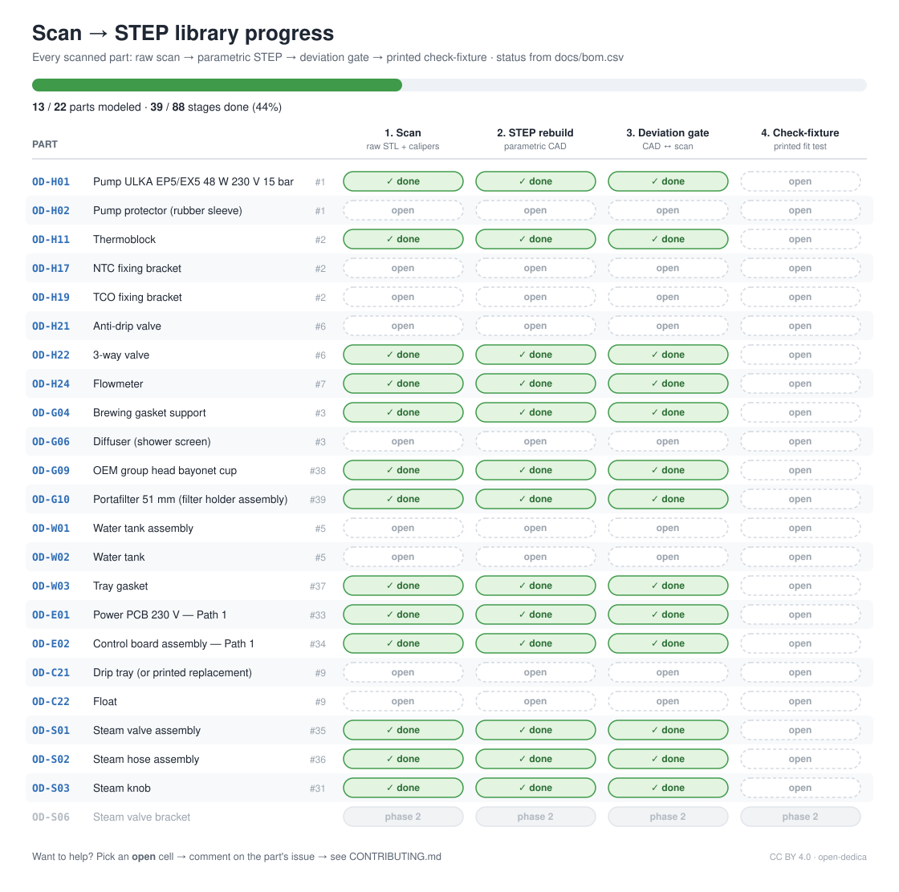

The board is **generated** from the `status` column of [`bom.csv`](bom.csv). To move a part along, change its status (`todo` → `scanned` → `modeled` → `validated`) and run:

```
python tools/build_bom.py
python tools/build_progress.py
```

Commit `bom.csv`, `BOM.md` and `img/step_progress.svg` together. CI fails if the board is stale.

| Stage | Done when | Lives in |
|---|---|---|
| 1. Scan | Raw STL/PLY + `calipers.md` + photos merged | `scans/OD-Xnn_<name>/` |
| 2. STEP rebuild | Clean parametric STEP, not a mesh export | `step/OD-Xnn_<name>.step` |
| 3. Deviation gate | Two-way CAD ↔ scan deviation report | `step/reports/OD-Xnn_<name>/` |
| 4. Check-fixture | Printed fixture fits the real part (photo in PR) | `step/OD-Xnn-FX_<name>_fixture.step` |

## Work in progress

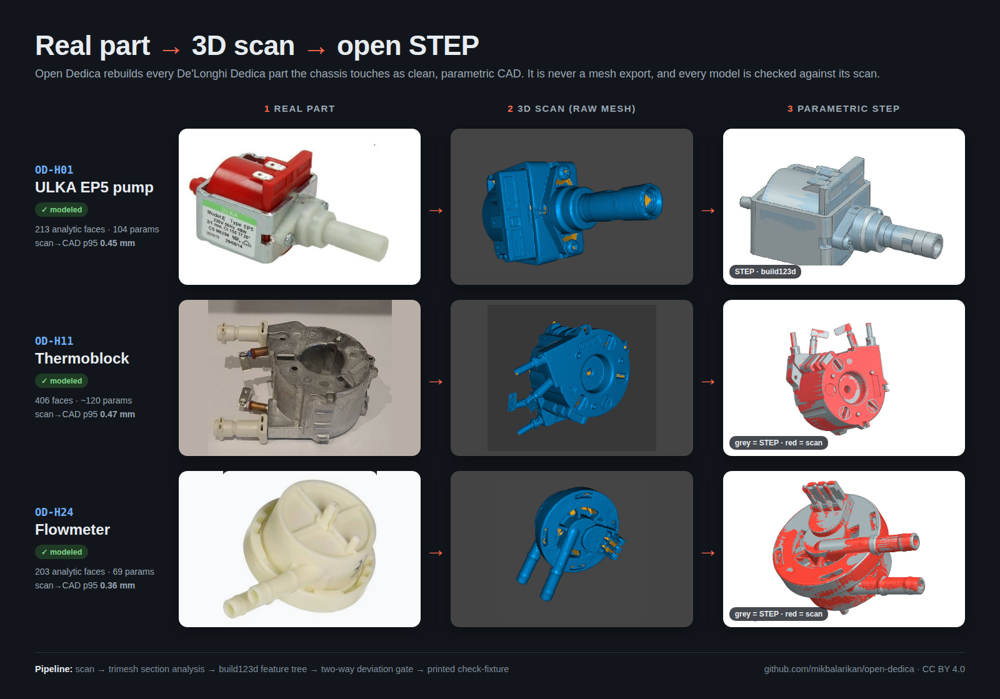

In the overlays, grey is the rebuilt STEP and red is the raw scan. Where both show, the CAD sits on the scan surface.

| `OD-H01` ULKA EP5 pump: modeled | `OD-H11` Thermoblock: modeled | `OD-H24` Flowmeter: modeled | `OD-H22` 3-way valve: modeled |
|---|---|---|---|
| 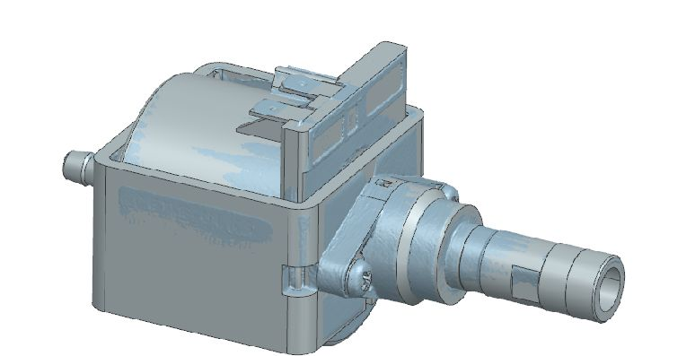 | 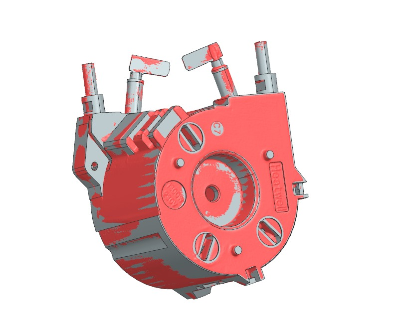 | 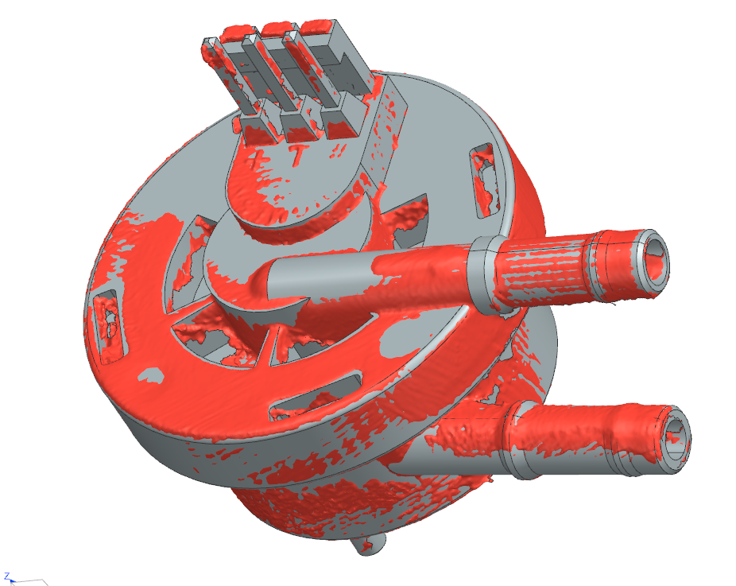 | 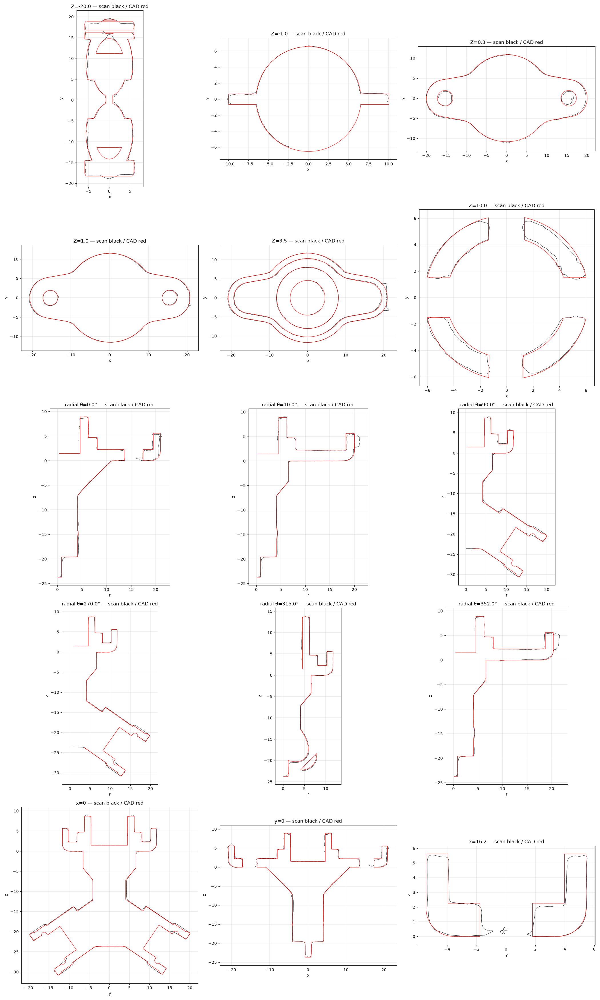 |
| [report](../step/reports/OD-H01_ulka_ep5_pump/) | [report](../step/reports/OD-H11_thermoblock/) | [report](../step/reports/OD-H24_flowmeter/) | [report](../step/reports/OD-H22_3way_valve/) |

| `OD-G04` Brewing gasket support: modeled | `OD-S03` Steam knob: modeled | `OD-E01` Power PCB: modeled | `OD-E02` Control button board: modeled |
|---|---|---|---|
| 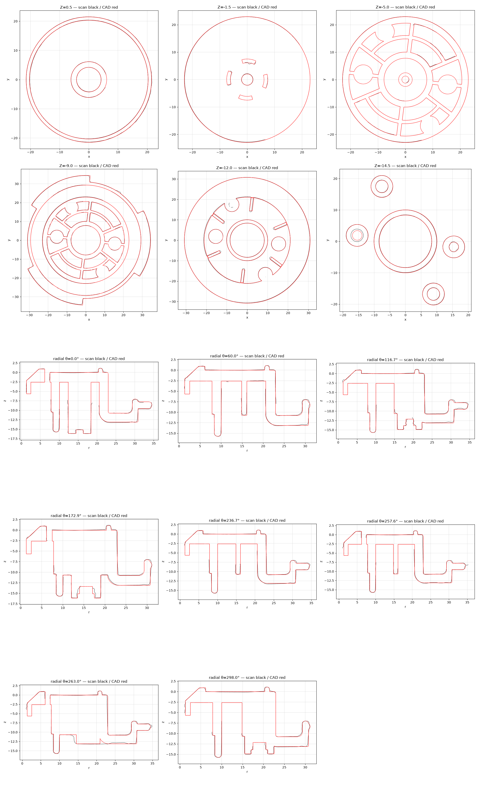 | 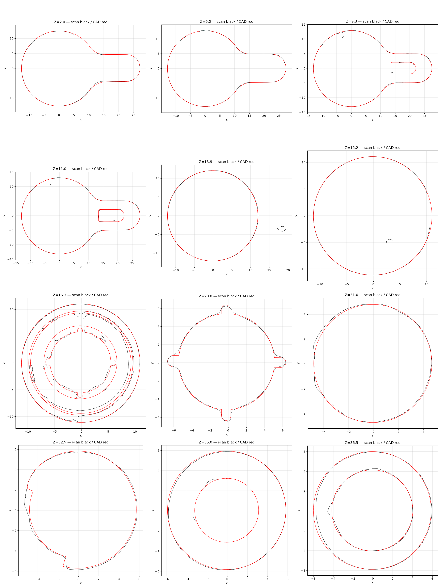 |  | 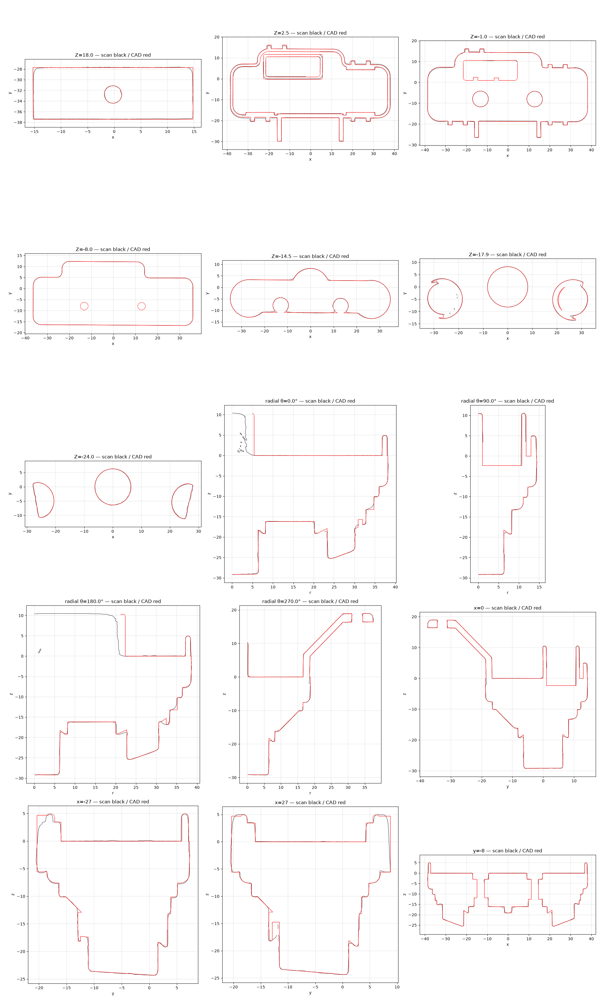 |
| [report](../step/reports/OD-G04_brewing_gasket_support/) | [report](../step/reports/OD-S03_steam_knob/) | [report](../step/reports/OD-E01_power_pcb/) | [report](../step/reports/OD-E02_control_board/) |

| `OD-S01` Steam valve: modeled | `OD-S02` Steam wand: modeled | `OD-W03` Tray gasket (tank seat): modeled | `OD-G09` Group head bayonet cup: modeled |
|---|---|---|---|
|  | 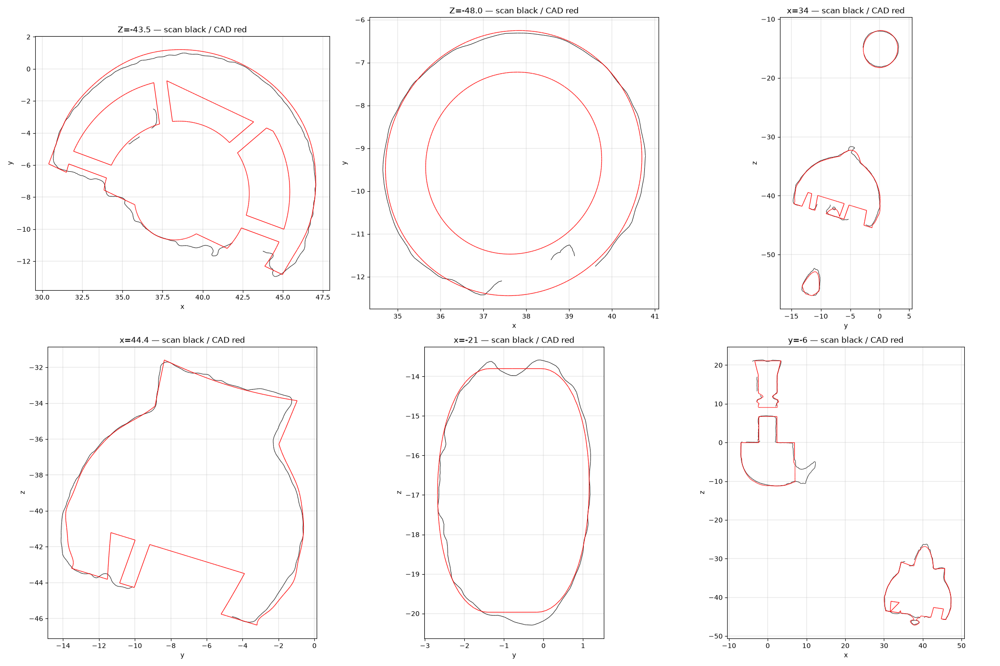 |  |  |
| [report](../step/reports/OD-S01_steam_valve/) | [report](../step/reports/OD-S02_steam_wand/) | [report](../step/reports/OD-W03_tank_seat/) | [report](../step/reports/OD-G09_group_head_bayonet_cup/) |

| `OD-G10` Portafilter: modeled | `OD-H21` Anti-drip valve: modeled |
|---|---|
|  |  |
| [report](../step/reports/OD-G10_portafilter/) | [report](../step/reports/OD-H21_antidrip_valve/) |

## Parts on the scanner

Donor parts on the scan turntable, matched to BOM numbers. All matches are confirmed.

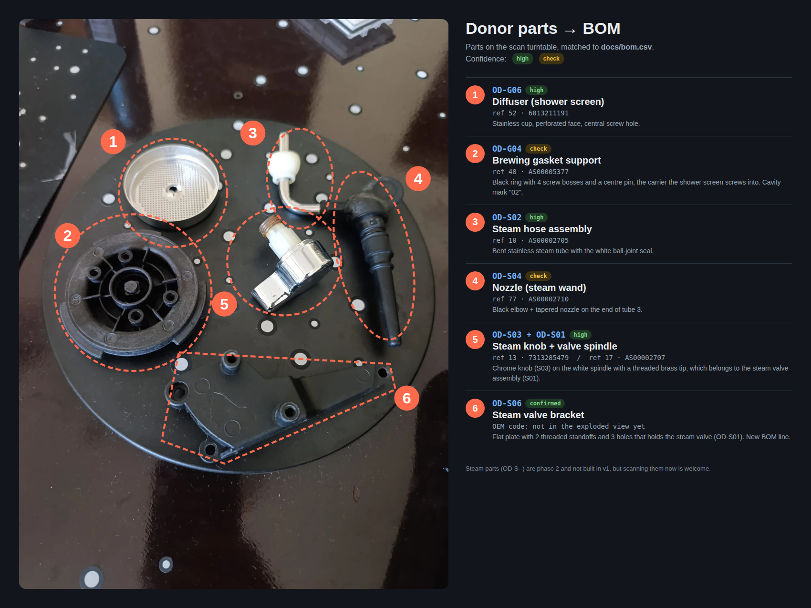

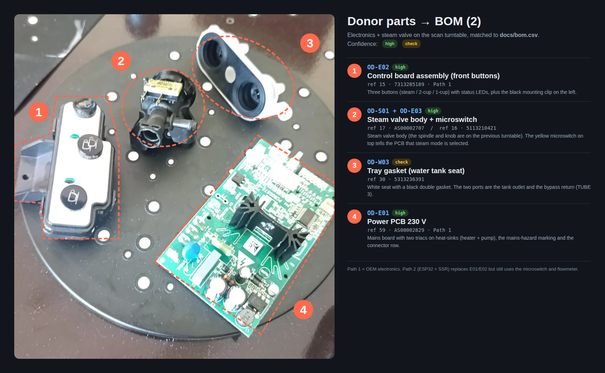

Next up: check-fixtures for every modeled part (stage 4). Every part still marked `open` in stage 1 needs someone with the part to scan it. See [CONTRIBUTING.md](../CONTRIBUTING.md).
