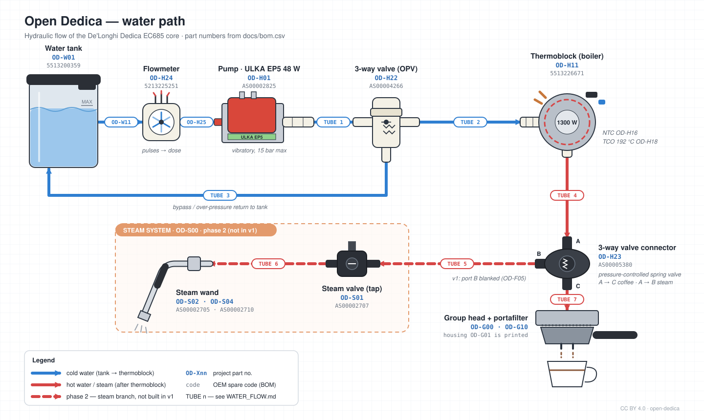

# Water path (flow diagram)

Source: [`img/water_flow.svg`](img/water_flow.svg). It is hand-written SVG, so edit it in a text editor or Inkscape and keep the part numbers in sync with [`bom.csv`](bom.csv).

## Flow, step by step

| # | From → To | Tube | Medium | Notes |
|---|---|---|---|---|
| 1 | Water tank `OD-W01` → Flowmeter `OD-H24` | `OD-W11` (L270) | cold | Tank outlet valve seat |
| 2 | Flowmeter `OD-H24` → Pump `OD-H01` | `OD-H25` | cold | Flowmeter pulses are used for volumetric dosing |
| 3 | Pump `OD-H01` → 3-way valve `OD-H22` | TUBE 1 | cold, up to 15 bar | ULKA EP5 vibratory pump |
| 4 | 3-way valve `OD-H22` → Thermoblock `OD-H11` | TUBE 2 | cold, pressurised | |
| 5 | 3-way valve `OD-H22` → Water tank `OD-W01` | TUBE 3 | cold | Bypass / over-pressure return |
| 6 | Thermoblock `OD-H11` → 3-way valve connector `OD-H23` port A | TUBE 4 | hot | NTC `OD-H16` and TCO 192 °C `OD-H18` sit on the thermoblock |
| 7 | Connector port C → Group head `OD-G00` / portafilter `OD-G10` | TUBE 7 | hot | Coffee path |
| 8 | Connector port B → Steam valve `OD-S01` | TUBE 5 | hot / steam | **Phase 2.** Port B is blanked in v1 (`OD-F05`) |
| 9 | Steam valve `OD-S01` → Steam wand `OD-S02` / nozzle `OD-S04` | TUBE 6 | steam | **Phase 2** |

The **3-way valve connector** `OD-H23` is a pressure-controlled spring valve: port A connects to port C (coffee) or to port B (steam).

## Tube numbering

TUBE 1–7 follow the numbering of the community EC685M flow diagram that this schematic is based on. Only the first two tubes (`OD-W11`, `OD-H25`) have been matched to BOM lines so far. The rest will be matched to `OD-W12…W15` during teardown. When you confirm one, update both this table and the SVG label.

## OEM code cross-reference

The original diagram used EC685 spare codes. Some of these differ from the EC885 exploded-view codes used in the BOM. Both are listed here so either one can be looked up:

| Part | BOM (EC885) | EC685 diagram |
|---|---|---|
| Water tank `OD-W01` | 5513200359 | 5513200359 |
| Flowmeter `OD-H24` | 5213225251 | 5213214671 |
| Pump `OD-H01` | AS00002825 | 5113211281 (ULKA Model E, CS M6294) |
| 3-way valve `OD-H22` | AS00004266 | 7313286129 |
| Thermoblock `OD-H11` | 5513226671 | 5513220541 |
| 3-way valve connector `OD-H23` | AS00005380 | 5313222031 |
| Steam valve `OD-S01` | AS00002707 | 7313281219 |
| Steam wand / frother `OD-S02` | AS00002705 | 5513226301 |
