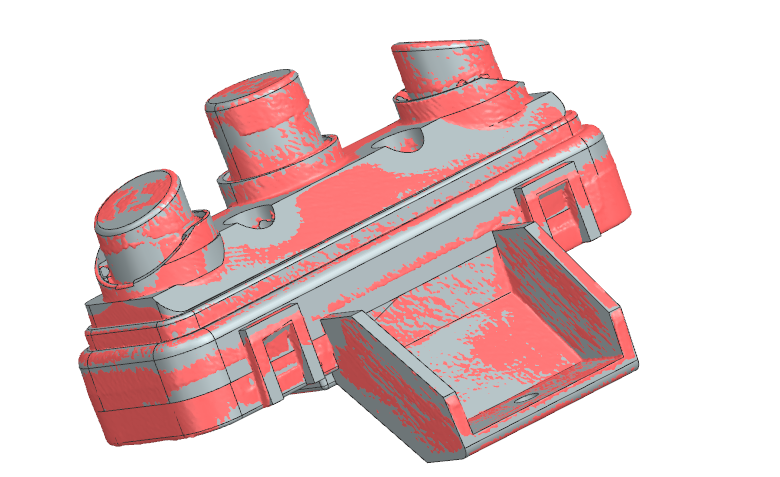

# OD-E02_control_board — Control button board

| | |
|---|---|
| Part | `OD-E02` (ref 15, OEM 7313285189) — see [docs/BOM.md](../../docs/BOM.md) |
| Mesh | `OD-E02_control_board_raw.stl` — binary STL, **mm**, full resolution, not watertight |
| Scanner | CR-Scan Raptor, 2 merged scan session(s) |
| Date | 2026-09-28 |

STEP rebuild: [`step/OD-E02_control_board.step`](../../step/OD-E02_control_board.step) — report in [`step/reports/OD-E02_control_board/`](../../step/reports/OD-E02_control_board/). Tracked in #34.

## Still missing for this scan
- [ ] `photos/` — own photos with a ruler (the RE run used catalogue images, which we can't publish)
- [ ] `calipers.md` — interface dimensions (the mesh is for the envelope only; calipers win on every fit)
