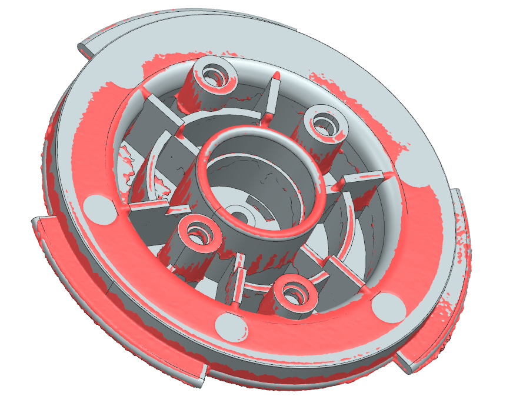

# OD-G04_brewing_gasket_support — Brewing gasket support

| | |
|---|---|
| Part | `OD-G04` (ref 48, OEM AS00005377) — see [docs/BOM.md](../../docs/BOM.md) |
| Mesh | `OD-G04_brewing_gasket_support_raw.stl` — binary STL, **mm**, 484 578 triangles, full resolution, not watertight |
| Bounding box | 68.0 × 50.8 × 47.2 mm (scanner frame, not aligned to part axes) |
| Scanner | Creality CR-Scan Raptor, laser mode, 0.1 mm fusion voxel, 2 merged scan sessions |
| Date | 2026-09-25 |

STEP rebuild: [`step/OD-G04_brewing_gasket_support.step`](../../step/OD-G04_brewing_gasket_support.step) — report in [`step/reports/OD-G04_brewing_gasket_support/`](../../step/reports/OD-G04_brewing_gasket_support/).

## Known mesh defects
- Front cavity / plate underside scanned in one sector only; hub interior and the outer-wall gap not reached.
- Thin walls (2.3–2.6 mm) — both skins are close together, so automatic registration can snap to the wrong side.

## Still missing for this scan
- [ ] `photos/` — own photos of front, back and side with a ruler (the RE run used catalogue images, which we can't publish)
- [ ] `calipers.md` — interface dimensions
