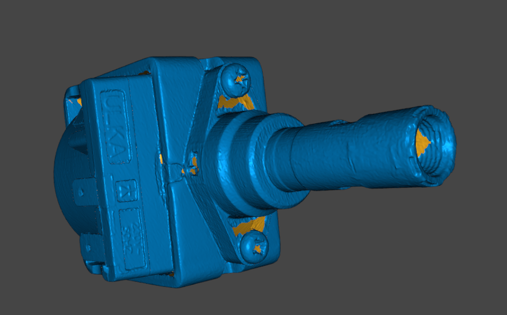

# OD-H01_ulka_ep5_pump — ULKA EP5 vibratory pump

| | |
|---|---|
| Part | `OD-H01 (ref 40, OEM AS00002825)` — see [docs/BOM.md](../../docs/BOM.md) |
| Mesh | `OD-H01_ulka_ep5_pump_raw.stl` — binary STL, **mm**, ~0.98 M triangles, not watertight |
| Bounding box | 67.2 × 119.6 × 74.7 mm (scanner frame, not aligned to part axes) |
| Scanner | Creality CR-Scan Raptor, laser mode, 0.1 mm fusion voxel, 3 merged scan sessions |
| Surface prep | none recorded |
| Date | 2026-09-25 |

## Known mesh defects
- Pump only — the rubber protector sleeve (OD-H02) and spring (OD-H03) are **not** in this scan; they still need their own scan / calipers for #1.
- Open patches (orange in preview) around the two body screws and inside the outlet spigot thread.
- The outlet spigot surface is noisy; take its diameter and thread from calipers.

## Still missing for this scan
- [ ] `photos/` — 6 sides + connector / mounting close-ups with a ruler
- [ ] `calipers.md` — interface dimensions (the mesh is for the envelope only; calipers win on every fit)
