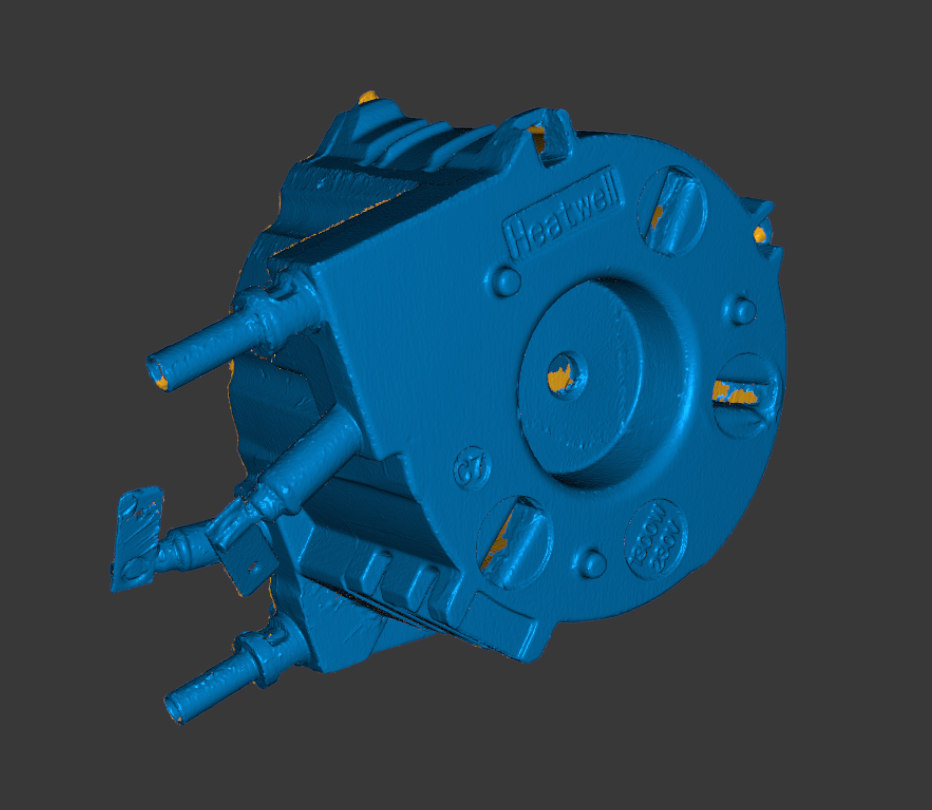

# OD-H11_thermoblock — Thermoblock (generator 230 V 1300 W)

| | |
|---|---|
| Part | `OD-H11 (ref 60, OEM 5513226671)` — see [docs/BOM.md](../../docs/BOM.md) |
| Mesh | `OD-H11_thermoblock_raw.stl` — binary STL, **mm**, ~0.98 M triangles, not watertight |
| Bounding box | 82.2 × 104.3 × 87.9 mm (scanner frame, not aligned to part axes) |
| Scanner | Creality CR-Scan Raptor, laser mode, 0.1 mm fusion voxel, 3 merged scan sessions |
| Surface prep | none recorded |
| Date | 2026-09-25 |

## Known mesh defects
- Open patches (orange in preview) at the three screw recesses on the front face, the central boss hole and the port tips — the scanner could not see inside them.
- Water ports and heater terminals are thin features; their diameters must come from calipers.
- Unknown whether the NTC (OD-H16/H17) and TCO (OD-H18/H19) brackets were fitted during the scan — note it here when confirmed.

## Still missing for this scan
- [ ] `photos/` — 6 sides + connector / mounting close-ups with a ruler
- [ ] `calipers.md` — interface dimensions (the mesh is for the envelope only; calipers win on every fit)
