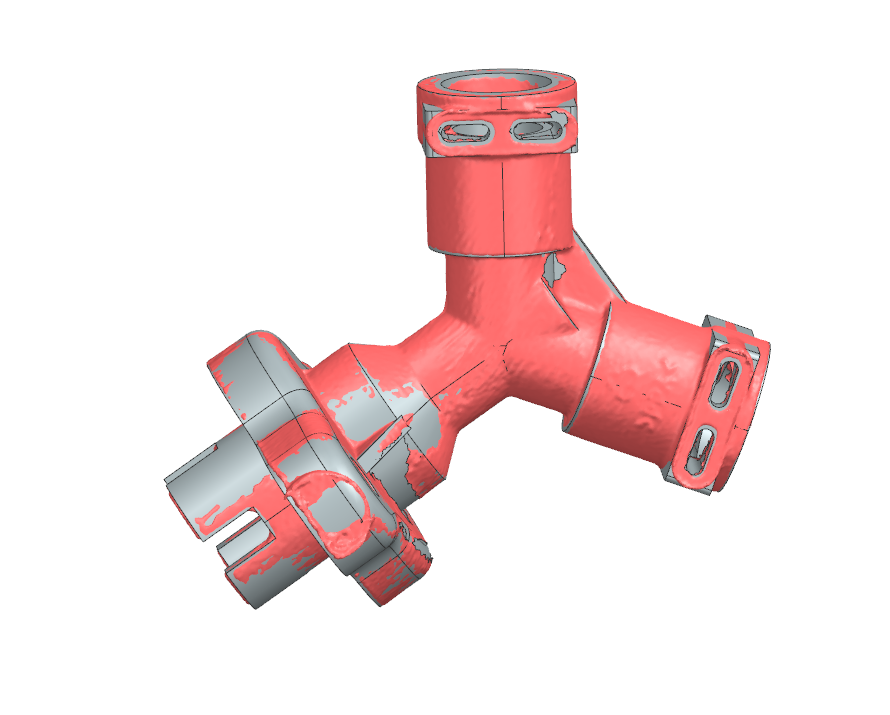

# OD-H22_3way_valve — 3-way valve

| | |
|---|---|
| Part | `OD-H22` (ref 43, OEM AS00004266) — see [docs/BOM.md](../../docs/BOM.md) |
| Mesh | `OD-H22_3way_valve_raw.stl` — binary STL, **mm**, 495 881 triangles, full resolution, not watertight |
| Bounding box | 40.0 × 42.0 × 48.1 mm (scanner frame, not aligned to part axes) |
| Scanner | Creality CR-Scan Raptor, laser mode, 0.1 mm fusion voxel, 2 merged scan sessions |
| Photos | [`photos/`](photos/) — 4 photos (feature identification only, no scale reference) |
| Date | 2026-09-25 |

STEP rebuild: [`step/OD-H22_3way_valve.step`](../../step/OD-H22_3way_valve.step) — report in [`step/reports/OD-H22_3way_valve/`](../../step/reports/OD-H22_3way_valve/).

## Known mesh defects
- The +X ear tip of this specimen is damaged / torn (jagged outline) — or carries a small pip (photo 4); unresolved.
- Stray scan material bridges the mouth of the +X ear screw hole (the hole is open through in the photos).
- Port bores and the lower drive-tube bore are unscanned (28 open boundary loops).

## Still missing for this scan
- [ ] `calipers.md` — interface dimensions (ear-hole spacing and Ø, port OD, drive-tube OD, flange thickness)
- [ ] Photos with a ruler / scale reference
