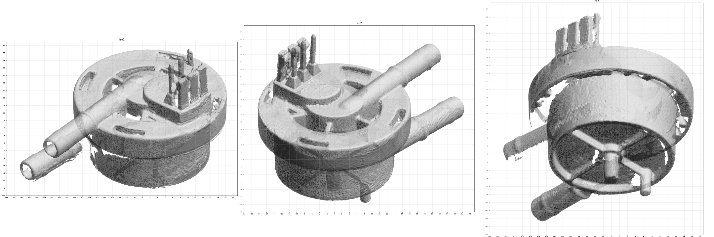

# OD-H24_flowmeter — Flowmeter (turbine, Hall sensor)

| | |
|---|---|
| Part | `OD-H24` (ref 45, OEM 5213225251) — see [docs/BOM.md](../../docs/BOM.md) |
| Mesh | `OD-H24_flowmeter_raw.stl` — binary STL, **mm**, 984 209 triangles, not watertight |
| Bounding box | 41.3 × 46.7 × 54.6 mm (scanner frame, not aligned to part axes) |
| Scanner | Creality CR-Scan Raptor, laser mode, 0.1 mm fusion voxel, 2 merged scan sessions |
| Surface prep | none recorded |
| Date | 2026-09-25 |

STEP rebuild: [`step/OD-H24_flowmeter.step`](../../step/OD-H24_flowmeter.step) — report in [`step/reports/OD-H24_flowmeter/`](../../step/reports/OD-H24_flowmeter/).

## Known mesh defects
- Underside of the flange and the cup-to-skirt gap are shadowed (~7 % of the surface never seen).
- The internal turbine chamber is visible only through the flange windows — not captured.
- Irregular flash / tab remnants inside the four outer slots.

## Still missing for this scan
- [ ] `photos/` — 6 sides + connector and hose-spigot close-ups with a ruler
- [ ] `calipers.md` — interface dimensions (the mesh is for the envelope only; calipers win on every fit)
