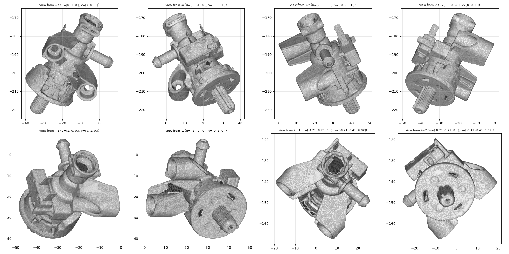

# OD-S01_steam_valve — Steam valve assembly

| | |
|---|---|
| Part | `OD-S01` (ref 17, OEM AS00002707) — see [docs/BOM.md](../../docs/BOM.md) |
| Mesh | `OD-S01_steam_valve_raw.stl` — binary STL, **mm**, full resolution, not watertight |
| Scanner | CR-Scan Raptor, 3 merged scan session(s) |
| Date | 2026-09-28 |

STEP rebuild: [`step/OD-S01_steam_valve.step`](../../step/OD-S01_steam_valve.step) — report in [`step/reports/OD-S01_steam_valve/`](../../step/reports/OD-S01_steam_valve/). Tracked in #35.

## Still missing for this scan
- [ ] `photos/` — own photos with a ruler (the RE run used catalogue images, which we can't publish)
- [ ] `calipers.md` — interface dimensions (the mesh is for the envelope only; calipers win on every fit)
