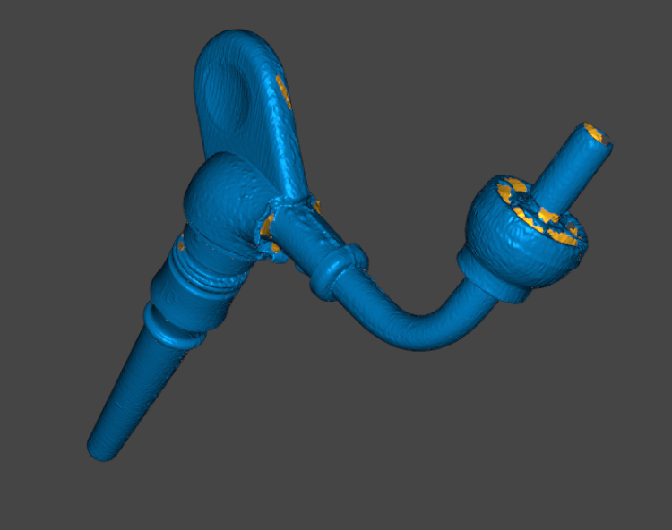

# OD-S02_steam_wand — Steam wand (steam hose assembly + nozzle)

| | |
|---|---|
| Part | `OD-S02` (ref 10 + 77, OEM AS00002705 + AS00002710) — see [docs/BOM.md](../../docs/BOM.md) |
| Mesh | `OD-S02_steam_wand_raw.stl` — binary STL, **mm**, full resolution, not watertight |
| Scanner | CR-Scan Raptor, 2 merged scan session(s) |
| Photos | [`photos/`](photos/) — 2 own photos (no scale reference) |
| Date | 2026-09-28 |

STEP rebuild: [`step/OD-S02_steam_wand.step`](../../step/OD-S02_steam_wand.step) — report in [`step/reports/OD-S02_steam_wand/`](../../step/reports/OD-S02_steam_wand/). Tracked in #36.

## Still missing for this scan
- [ ] `calipers.md` — interface dimensions (the mesh is for the envelope only; calipers win on every fit)
