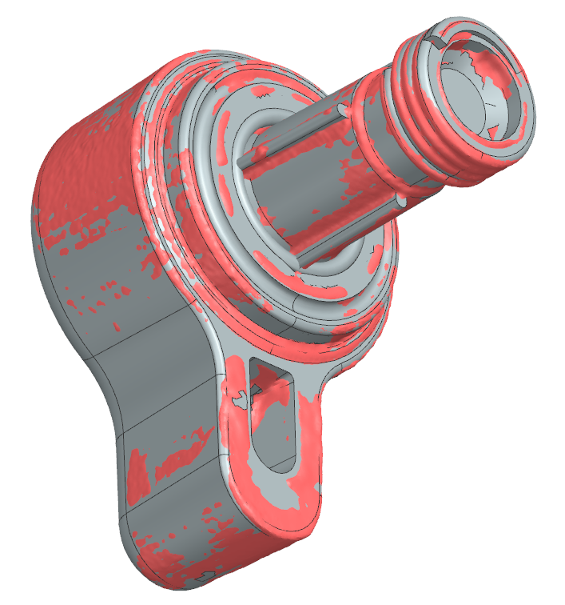

# OD-S03_steam_knob — Steam knob

| | |
|---|---|
| Part | `OD-S03` (ref 13, OEM 7313285479) — see [docs/BOM.md](../../docs/BOM.md) |
| Mesh | `OD-S03_steam_knob_raw.stl` — binary STL, **mm**, 363 988 triangles, full resolution, not watertight |
| Bounding box | 31.3 × 39.2 × 37.4 mm (scanner frame, not aligned to part axes) |
| Scanner | Creality CR-Scan Raptor, laser mode, 2 merged scan sessions |
| Date | 2026-09-25 |

STEP rebuild: [`step/OD-S03_steam_knob.step`](../../step/OD-S03_steam_knob.step) — report in [`step/reports/OD-S03_steam_knob/`](../../step/reports/OD-S03_steam_knob/).

## Known mesh defects
- Chrome surfaces: a loose "skin flap" inside the cap wall at a scan-hole edge (the real wall is intact).
- Lever-pocket floor and the deep sleeve bore (with internal splines) not reached.

## Still missing for this scan
- [ ] `photos/` — own photos with a ruler (the RE run used catalogue images, which we can't publish)
- [ ] `calipers.md` — interface dimensions
