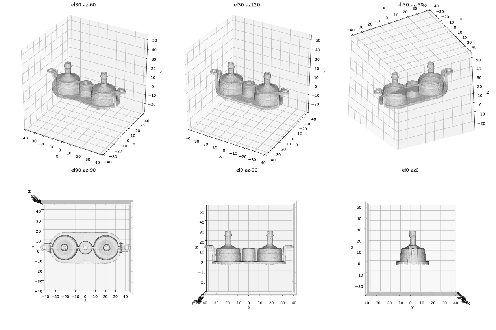

# OD-W03_tank_seat — Tray gasket (water tank seat)

| | |
|---|---|
| Part | `OD-W03` (ref 30, OEM 5313236391) — see [docs/BOM.md](../../docs/BOM.md) |
| Mesh | `OD-W03_tank_seat_raw.stl` — binary STL, **mm**, full resolution, not watertight |
| Scanner | CR-Scan Raptor, 1 merged scan session(s) |
| Date | 2026-09-28 |

STEP rebuild: [`step/OD-W03_tank_seat.step`](../../step/OD-W03_tank_seat.step) — report in [`step/reports/OD-W03_tank_seat/`](../../step/reports/OD-W03_tank_seat/). Tracked in #37.

## Still missing for this scan
- [ ] `photos/` — own photos with a ruler (the RE run used catalogue images, which we can't publish)
- [ ] `calipers.md` — interface dimensions (the mesh is for the envelope only; calipers win on every fit)
