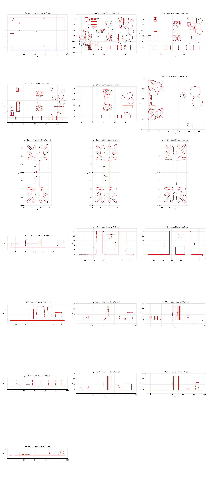

# OD-E01 Power PCB — scan → STEP reverse-engineering report

| | |
|---|---|
| Part | `OD-E01` (ref 59, OEM AS00002829) — Populated appliance power PCB (board id PCB00572-01): board, heatsink with a TO-220 and spring clip, electrolytic and film capacitors, faston tabs, connectors and SMD parts, delivered as ONE fused envelope solid of the component side for enclosure / fit design. |
| Input | [`scans/OD-E01_power_pcb/OD-E01_power_pcb_raw.stl`](../../../scans/OD-E01_power_pcb/) — full-resolution scan |
| Method | staged pipeline — intake → measure → build (build123d) → independent verifier → deliver |
| Caliper data | **none** — scan-only; units assumed mm |
| Status | **Owner-reviewed and accepted** (`DECISIONS.md`, `decisions/`) — tracked in #33 |

**Full report: [`deliver/README.md`](deliver/README.md)** · verifier report: [`qa/VERDICT.md`](qa/VERDICT.md).

## Delivered STEP

[`step/OD-E01_power_pcb.step`](../../OD-E01_power_pcb.step) — **use in CAD**. Datum frame: Intake: full-resolution scan hashed, noise floors measured, datum = PCB top face (z 0, +Z out of the component side), mounting hole H1 axis as origin, +X along the long board edge (clock on the +X short edge).

Same solid as the run's `build/OD-E01_Power-PCB_datum.step`; only the STEP product / solid name was changed to `OD-E01 Power PCB`, so sha256 values in `deliver/MANIFEST.json` refer to the run original. No scan-frame STEP is published — apply the inverse of `source/intake/alignment.json` to overlay the CAD on the raw scan.

Re-import check: 1 valid closed solid, 1233 faces, volume 20,609.9 mm³, datum bbox 100.16 × 59.87 × 26.82 mm.

## Deviation (CAD ↔ scan)

| Direction | Measured |
|---|---|
| scan → CAD | p95 **0.763** / max 1.365 mm |
| CAD → scan (observable surface) | p95 1.599 / max 4.408 mm |

CAD → scan is dominated by surfaces the scanner never reached (bores, undersides, assembly interfaces); see `qa/VERDICT.md` for masks and clusters.

## Notes

- The run's reference photos were catalogue / web images and are **not redistributed**, so image links to `input/photos/` in the run documents are intentionally broken.
- Not copied from the run: meshes, STEP duplicates, NX files, deviation arrays and other files > 5 MB, superseded iterations.
- `deliverables/` of the run is at this folder's root; the run's `source/` (intake, measure, qa work files) is in [`source/`](source/).
