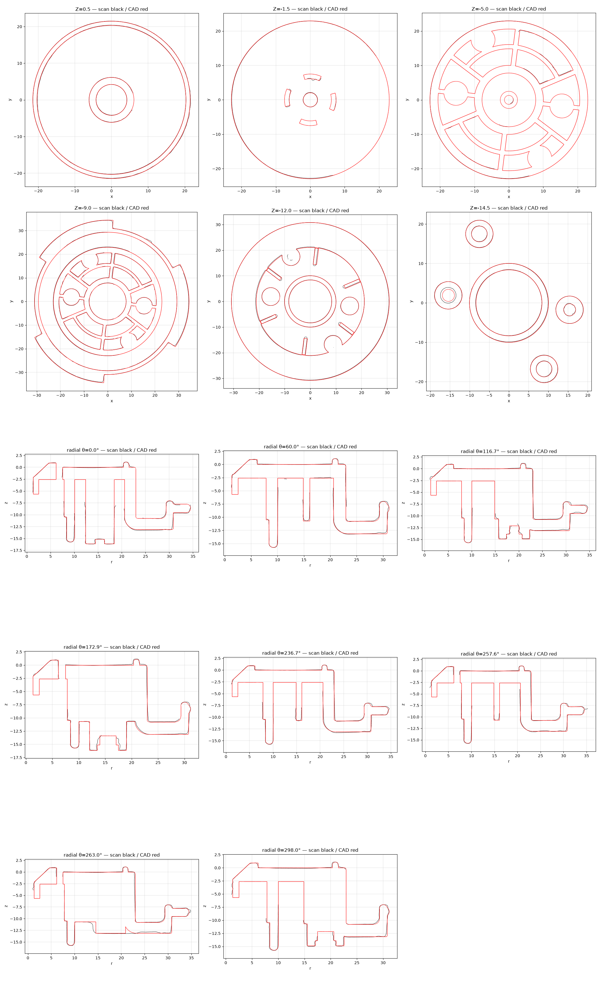

# OD-G04 Brewing gasket support — scan → STEP reverse-engineering report

| | |
|---|---|
| Part | `OD-G04` (ref 48, OEM AS00005377) — molded plastic brew-group gasket support disc |
| Input | [`scans/OD-G04_brewing_gasket_support/OD-G04_brewing_gasket_support_raw.stl`](../../../scans/OD-G04_brewing_gasket_support/) — 484 578 triangles, full resolution |
| Method | staged pipeline — intake → measure (67 parameters: 66 scan, 1 photo-inferred) → build (build123d: one revolve profile + tabs, ribs, ring arcs, bosses, webs) → **independent verifier** (own ICP) → deliver |
| Caliper data | **none** — scan-only |
| Verdict | **`BAND_NOT_MET` — accepted by the owner for delivery** ([`decisions/accept_band.md`](decisions/accept_band.md)) |

**Full report: [`deliver/README.md`](deliver/README.md)** (method, frames, all parameters, per-zone deviation, limitations, reproduction, provenance).

> The run's four reference photos were seller catalogue images and are **not redistributed** here, so image links to `input/photos/` in the run documents are intentionally broken. Photo 1 was used only to infer the centre-post radius (2.5 mm, limitation L7).

## Delivered STEP

| File in this repo | = file in the run | Frame |
|---|---|---|
| [`step/OD-G04_brewing_gasket_support.step`](../../OD-G04_brewing_gasket_support.step) — **use in CAD** | `build/OD-G04_brewing-gasket-support_datum.step` | datum: plate back face = Z 0, cup outer-wall axis = +Z, bayonet tab 1 toward +X |
| *(not published)* | `build/OD-G04_brewing-gasket-support.step` | original scan coordinates — apply the inverse of `intake/alignment.json` to the datum STEP to overlay it on the raw scan |

The repo copy differs from the run file only in the STEP product / solid name (`OD-G04 Brewing gasket support`), so the sha256 values in `deliver/MANIFEST.json` refer to the run original.
Not copied from the run: meshes (`input/scan.stl`, `intake/*.stl`, `build/*_cad.stl`), deviation arrays (`qa/*.npz`, 33 MB), catalogue photos.

Re-import check: 1 valid closed solid, 174 faces, volume 17 086.2 mm³, datum bbox 65.70 × 69.00 × 17.21 mm.

## Deviation gate (independent verifier, `qa/VERDICT.md`)

| Gate | Band | Measured | Result |
|---|---|---|---|
| scan → CAD | p95 ≤ 0.30 / max ≤ 0.80 | p95 0.376 / max 0.832 | FAIL |
| CAD → scan (observable) | p95 ≤ 0.30 / max ≤ 0.80 | p95 2.33 / max 4.59 | FAIL |
| Validity, ICP registration | — | — | PASS |

- **The scan → CAD p95 miss is a registration artefact, not geometry:** the verifier's ICP paired faces across the 2.3–2.6 mm walls and shifted the CAD 0.29 mm in Z. In the builder's datum frame p95 is **0.218**, and a diagnostic ICP with 1 mm correspondence gives **0.194** — both pass (`qa/diagnostic/`).
- The max 0.832 mm is 3 isolated points out of 245 660.
- CAD → scan fails in regions the scanner never reached (front cavity / plate underside, hub interior, outer-wall gap); 65 % of the over-band CAD points sit next to a scan-hole edge.
- Not modeled (cosmetic): molded text and ejector-pin dimples on the flange.

Good enough for the **group-head housing design** (`OD-G01`) — this disc sets the gasket seat and bayonet geometry. Confirm plate thickness, bayonet tab width / pitch and the screw-boss pattern with calipers before the housing is frozen.

## Folder map

`intake/` datum + alignment · `measure/` `params.json`, `PARAM_TABLE.md`, `make_params.py` · `build/` `model.py`, `MODELING_PLAN.md`, export checks · `qa/` verdict, gate, deviation, diagnostic ICP, overlays · `decisions/`, `DECISIONS.md` owner decisions · `deliver/` report, manifest, limitations, repro · `input/` input hashes (photos withheld).
