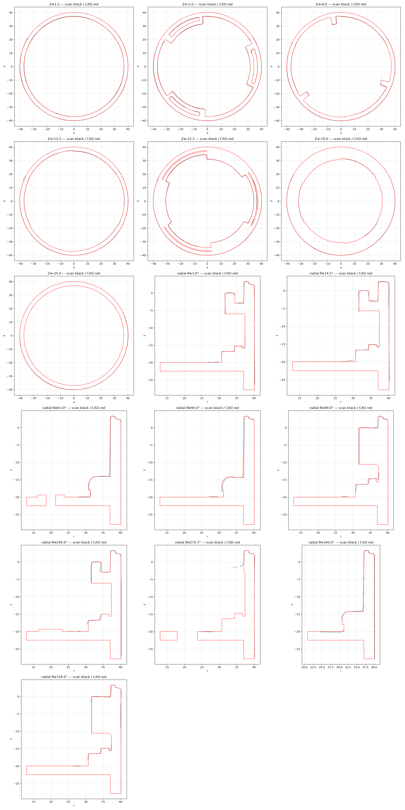

# OD-G09 OEM group head bayonet cup — scan → STEP reverse-engineering report

| | |
|---|---|
| Part | `OD-G09` (ref —, OEM — (molded into the OEM case)) — Espresso-machine portafilter holder (group-head collar), moulded plastic: a cup with three internal bayonet lugs (stop block, ramped underside, top channel), a stepped shelf with under-lug pockets, a lip ring and a bottom plate with a two-lobed water opening and two screw bosses. |
| Input | [`scans/OD-G09_group_head_bayonet_cup/OD-G09_group_head_bayonet_cup_raw.stl`](../../../scans/OD-G09_group_head_bayonet_cup/) — full-resolution scan |
| Method | staged pipeline — intake → measure → build (build123d) → independent verifier → deliver |
| Caliper data | **none** — scan-only; units assumed mm |
| Status | **Owner-reviewed and accepted** (`DECISIONS.md`, `decisions/`) — tracked in #38 |

> **Part number:** New BOM row — reference geometry for the printed group-head housing `OD-G01`. The local RE run called it `OD-G10`; `OD-G10` in the BOM is the portafilter.

**Full report: [`deliver/README.md`](deliver/README.md)** · verifier report: [`qa/VERDICT.md`](qa/VERDICT.md).

## Delivered STEP

[`step/OD-G09_group_head_bayonet_cup.step`](../../OD-G09_group_head_bayonet_cup.step) — **use in CAD**. Datum frame: 

Same solid as the run's `build/OD-G10_porta_filter_holder_datum.step`; only the STEP product / solid name was changed to `OD-G09 OEM group head bayonet cup`, so sha256 values in `deliver/MANIFEST.json` refer to the run original. No scan-frame STEP is published — apply the inverse of `source/intake/alignment.json` to overlay the CAD on the raw scan.

Re-import check: 1 valid closed solid, 182 faces, volume 40,425.4 mm³, datum bbox 80.22 × 80.22 × 31.13 mm.

## Deviation (CAD ↔ scan)

| Direction | Measured |
|---|---|
| scan → CAD | p95 **0.971** / max 1.826 mm |
| CAD → scan (observable surface) | p95 9.008 / max 15.583 mm |

> Scan coverage is partial (the cup is scanned from above only; underside and plate interior are not in the scan), so the automatic registration could not lock and these numbers are indicative only. The model was **reviewed and verified by the owner** — see `DECISIONS.md`.

CAD → scan is dominated by surfaces the scanner never reached (bores, undersides, assembly interfaces); see `qa/VERDICT.md` for masks and clusters.

## Notes

- Own photos are in [`scans/OD-G09_group_head_bayonet_cup/photos/`](../../../scans/OD-G09_group_head_bayonet_cup/photos/).
- Not copied from the run: meshes, STEP duplicates, NX files, deviation arrays and other files > 5 MB, superseded iterations.
- `deliverables/` of the run is at this folder's root; the run's `source/` (intake, measure, qa work files) is in [`source/`](source/).
