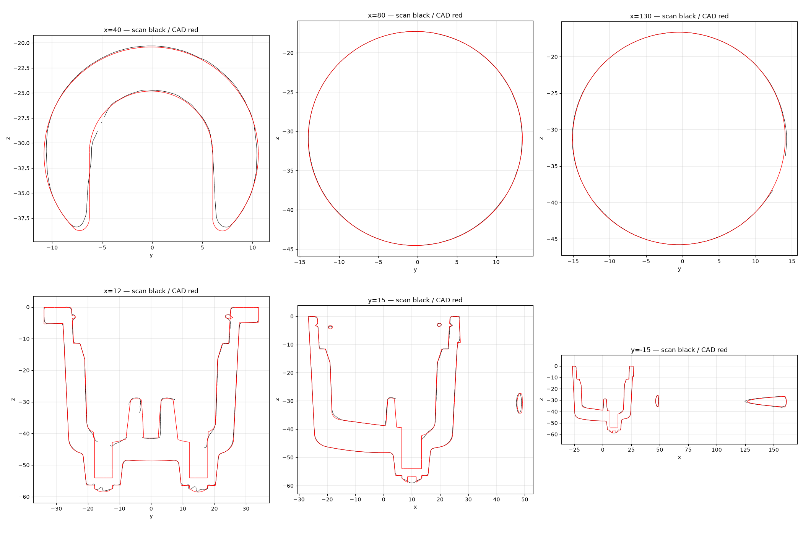

# OD-G10 Portafilter 51 mm — scan → STEP reverse-engineering report

| | |
|---|---|
| Part | `OD-G10` (ref 06, OEM AS00002706) — Espresso portafilter scanned as one assembly: cast cup with three bayonet lugs, two spout bosses with pan-head screws and a centre screw, open-bottom arch neck, tapered grip with collar and end cap, a pressurised insert (funnel floor, outlet trough, U rib, two V ribs, outlet pockets) and a round-wire retaining spring. Delivered as ONE fused solid (owner decision). |
| Input | [`scans/OD-G10_portafilter/OD-G10_portafilter_raw.stl`](../../../scans/OD-G10_portafilter/) — full-resolution scan |
| Method | staged pipeline — intake → measure → build (build123d) → independent verifier → deliver |
| Caliper data | **none** — scan-only; units assumed mm |
| Status | **Owner-reviewed and accepted** (`DECISIONS.md`, `decisions/`) — tracked in #39 |

> **Part number:** The local RE run called it `OD-G11`; in the BOM `OD-G10` is the portafilter and `OD-G11` the 1-cup basket.

**Full report: [`deliver/README.md`](deliver/README.md)** · verifier report: [`qa/VERDICT.md`](qa/VERDICT.md).

## Delivered STEP

[`step/OD-G10_portafilter.step`](../../OD-G10_portafilter.step) — **use in CAD**. Datum frame: Datum: cup rim end face (gasket seat) is z = 0 with +Z out of the opening; cup axis from wall-face circle fits; handle end-cap normal clocks the handle to +X.

Same solid as the run's `build/OD-G11_portafilter_datum.step`; only the STEP product / solid name was changed to `OD-G10 Portafilter 51 mm`, so sha256 values in `deliver/MANIFEST.json` refer to the run original. No scan-frame STEP is published — apply the inverse of `source/intake/alignment.json` to overlay the CAD on the raw scan.

Re-import check: 1 valid closed solid, 202 faces, volume 137,692.6 mm³, datum bbox 201.72 × 70.20 × 59.02 mm.

## Deviation (CAD ↔ scan)

| Direction | Measured |
|---|---|
| scan → CAD | p95 **0.284** / max 1.346 mm |
| CAD → scan (observable surface) | p95 0.378 / max 4.902 mm |

CAD → scan is dominated by surfaces the scanner never reached (bores, undersides, assembly interfaces); see `qa/VERDICT.md` for masks and clusters.

## Notes

- Own photos are in [`scans/OD-G10_portafilter/photos/`](../../../scans/OD-G10_portafilter/photos/).
- Not copied from the run: meshes, STEP duplicates, NX files, deviation arrays and other files > 5 MB, superseded iterations.
- `deliverables/` of the run is at this folder's root; the run's `source/` (intake, measure, qa work files) is in [`source/`](source/).
