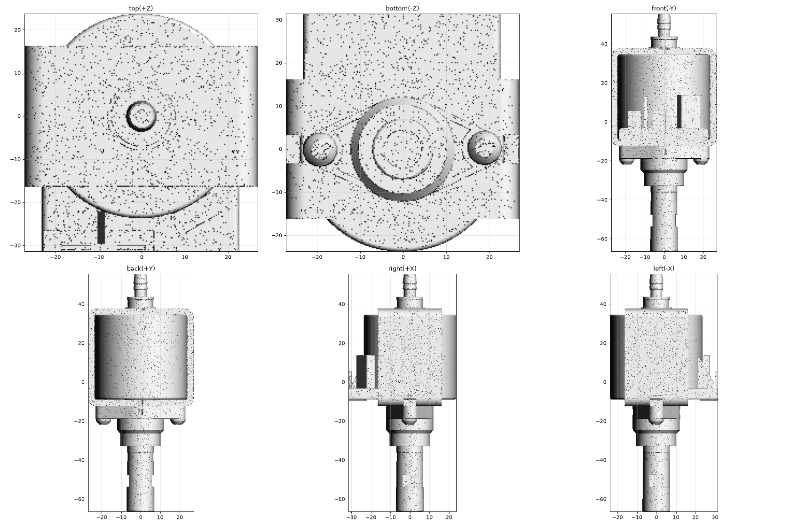

# OD-H01 ULKA EP5 pump — scan → STEP reverse-engineering report



| | |
|---|---|
| Part | `OD-H01` (ref 40, OEM AS00002825) |
| Input | [`scans/OD-H01_ulka_ep5_pump/OD-H01_ulka_ep5_pump_raw.stl`](../../../scans/OD-H01_ulka_ep5_pump/) — 979 819 triangles, not watertight |
| Method | trimesh datum / section analysis → build123d design-intent rebuild (revolve + extrude + boolean) → two-way deviation gate |
| Caliper data | **none yet** — every dimension comes from the scan |

## Deliverables

| File | Content |
|---|---|
| [`step/OD-H01_ulka_ep5_pump.step`](../../OD-H01_ulka_ep5_pump.step) | **Use this for CAD.** Datum frame: pump axis = +Z (outlet −Z, inlet fitting +Z), X = normal of the sheet-metal frame side plate, origin on the axis. |
| *(scan-frame STEP not published)* | To overlay the CAD on the raw scan, apply the inverse of `src/T1.npy` (scan → datum 4×4) to the STEP. |
| `*.json`, `*.png` | Parameters (104), gate / validator / export reports, overlays, deviation map |
| `src/` | Rebuild + gate scripts; `T1.npy` / `alignment_T1.json` = 4×4 scan → datum transform |

Re-import check: **1 solid, valid, closed, 213 faces, volume 114 903 mm³**, datum bbox 54.05 × 55.15 × 121.95 mm.
Analytic surfaces only (planes, cylinders, cones, tori) — not a mesh-wrapped STEP.

## Deviation gate (CAD ↔ scan, datum frame)

| Direction | RMS | p95 | p99 | max |
|---|---|---|---|---|
| scan → CAD (493 060 points) | 0.217 | **0.448** | 0.674 | 2.49 |
| CAD → scan, visible surfaces | 0.354 | **0.567** | 1.56 | 8.65 |

Regional scan → CAD p95: outlet tube 0.39 · front body/flange 0.49 · coil + frame 0.45 · inlet fitting 0.27 mm.

**Verdict:** the consumer-plastic band (p95 ≤ 0.30 / max ≤ 0.80 mm) is **not met** (p95 0.448, max 2.49).
- The scan itself carries ~0.13 mm p95 noise even on a clean cylinder; the coil is slightly conical/wavy (r 23.50–23.84) and was fitted as a single Ø47.30 cylinder.
- Only 0.16 % of points deviate > 1.2 mm: the shadowed inside of the flange pocket, spade blades inside the terminal slot, embossed lettering (ULKA / 230V 50Hz), small embossings on the side plates, screw-head recess detail — cosmetic/internal, intentionally not modeled.
- 25.6 % of the CAD surface is invisible to the scanner (gap between plate and coil, bores, flange pocket), so CAD → scan raw numbers are not meaningful there.

Good enough for **chassis envelope and pump-cradle design**. Mating features (spigots, flange, terminals) must be confirmed with calipers before the cradle (`OD-C03`) is frozen.

## Model tree (design intent)

1. **Revolved body:** outlet tip Ø14.0 (0.4 chamfer, Ø9.1 × 7 mouth) → Ø13.84 → Ø13.56 → Ø13.14 → Ø13.48 → Ø20.5 at z = −32.75 → cone → Ø24.0 body; **A/F 11.6 wrench flats** on ±X (z −53.7…−47.6). Rear: Ø15.7 washer → Ø13.0 neck → Ø13.7 collar → Ø5.9 double-barb hose fitting (barb Ø6.96), Ø3.0 bore.
2. **Coil:** Ø47.30, z −8.8…34.5, edge radius 1.0; centre 0.2 mm off-axis (measured, not snapped).
3. **Sheet-metal U-frame:** outer 54.05 × 50.05 (XZ), width 32.4 (Y), sheet 3.1, outer bend R4.5; front-edge notches (6.6 wide), U-slot in front plate, two U-pockets in rear plate.
4. **Core tube (hidden):** Ø16 plate-to-plate — the solenoid tube, not visible in the scan.
5. **Diamond flange:** Ø24.1 hub + 2 × R3.9 lobes, z −12.4…−18.7; 2.2-deep pocket underneath, U-windows at ±Y; **2 pan-head screws** (Ø7.7 dome).
6. **Terminal block:** 45.7 × 22.4 × ~6; 2 spade tabs (6.5 × 0.8, in pocket), inclined rib, slot box rotated 29.6°.

## Assumptions to verify (with calipers / photos)

- **Scale:** STL assumed mm (122 mm length matches ULKA EX5 datasheet) — not caliper-checked.
- **Hidden geometry is estimated:** sheet thickness 3.1, core tube Ø16, flange pocket depth, bore depths (outlet 7 mm, fitting 12 mm).
- **Single body:** coil, frame, plastic body, screws and spades are fused into one solid. A multi-body STEP would be a separate task.
- Embossed text, spade internals and screw-recess geometry approximated or omitted.
- The validator (13/13 PASS) compares against scan-derived expectations — a consistency check, not independent evidence. The deviation gate is the independent evidence.

## Reproduce

```
cd src
python export_final.py out                      # needs build123d; T1.npy + pump.stl (= raw scan STL) in this folder
python gate.py pump.stl T1.npy out/OD-H01_ulka_ep5_pump.stl out/gate
```
Deterministic (fixed seeds).
