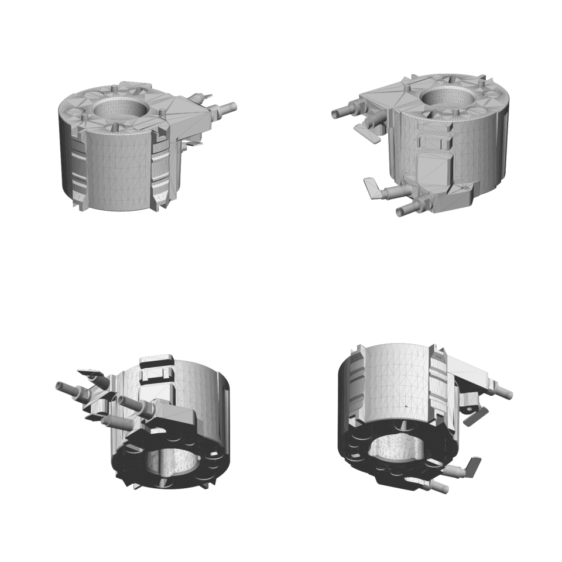

# OD-H11 Thermoblock — scan → STEP reverse-engineering report (feature-based, v2)



| | |
|---|---|
| Part | `OD-H11` (ref 60, OEM 5513226671) — cast-aluminium thermoblock, 230 V 1300 W |
| Input | [`scans/OD-H11_thermoblock/OD-H11_thermoblock_raw.stl`](../../../scans/OD-H11_thermoblock/) — 988 798 triangles, not watertight |
| Method | trimesh analysis → build123d feature tree (sketch → extrude / revolve / loft / cut), ~120 named parameters measured from the scan, two-way deviation gate. Same approach as [`OD-H01`](../OD-H01_ulka_ep5_pump/). |
| Caliper data | **none yet** — every dimension comes from the scan |

## Deliverables

| File | Content |
|---|---|
| [`step/OD-H11_thermoblock.step`](../../OD-H11_thermoblock.step) | **Use this for CAD.** Datum frame: base at Z = 0, body axis = +Z, top face Z = 47.64. |
| *(scan-frame STEP not published)* | To overlay the CAD on the raw scan, apply the inverse of `src/T.npy` (scan → datum 4×4) to the STEP. |
| `*.json`, `*.png` | Parameters, deviation report, section overlays, signed deviation map |
| `src/` | `build_ft.py` (feature tree), `export_final.py`, `gate_ft.py`; `T.npy` = 4×4 scan → datum transform; `bore_prof.json` (bore lobe profiles), `ports.json` (pipe / terminal axes) |

Re-import check: **1 manifold solid, 1 closed shell, valid, 406 faces, volume 159 767 mm³** (repaired scan: 160 289 mm³),
datum bbox 86.11 × 106.89 × 50.79 mm. Faces: 284 plane, 73 cylinder, 43 cone, 6 B-spline (lofted 3-lobe bore). 2.4 MB.

## Feature tree (design intent)

1. **Body (revolve)** — cast with a vertical parting line; the two halves are drafted in opposite directions: main sector r 33.78 → 34.95, sector θ 69–172° r 34.97 → 33.85; base chamfer 0.5, top chamfer 0.4.
2. **Rib pads ×2** (θ 262.5°, 339°) — revolved step profile ∩ column prism: rib crests R36.25, ear blocks R39.4 with 45° chamfers, pad base R35.05.
3. **Ear notches + clip holes** above/below both pads (5.2 / 4.95 wide).
4. **Side block** (θ 107.5°) — lower block z 11.8–27.6 with drafted outer face (loft), upper tabs z 32.9–38.6 and 43.9–47.2, 2 vertical slots, 2 flat pockets.
5. **Lugs** — upper pear lug z 36.3–47.64; middle lug z 27.6–36.3 with Ø3.5 blind hole; pipe lug z 0–9.5 (step to 11.8); lower U-notch z 0–3.2 with Ø3.6 blind hole; oval pocket on top.
6. **3 vertical grooves** R4.25 on pitch radius 36.75 (θ 9.8° / 49.8° / 189.4°).
7. **Central bore** — 3-lobe profile, 120° periodic (fold RMS 0.03 mm); lofted from base to web (z 34.5): lobe root r 15.3 → 13.8, lobe tip 18.1 → 17.7 (casting draft); bottom chamfer 1.3.
8. **Web + counterbore** — web z 34.5–37.8 with Ø6.0 hole (0.6 chamfer); conical counterbore r 14.13 → 14.99 (5° draft), top chamfer 1.3.
9. **Pockets** — 3 top + 2 bottom 11.9 × 3.6 slots, each in a Ø11.4 spot-face; bottom 4.76 × 3.62 pocket; bottom dimples Ø5.7 / 5.9 / 7.9 / 11.4; top Ø11.8 dimple and 20.4 × 6.4 label pocket.
10. **Top pins ×3** — conical Ø3.9 → Ø3.35 on PCD Ø50, 120° apart, top Z 50.79.
11. **Water pipes ×2** (revolve) — Ø5.0 pipe, Ø8.9 collar, 5.6 mm clip flats, tip bore Ø3.9 × 2.3 (as far as visible).
12. **Heater terminals ×2** (revolve) — Ø6.6 / 6.7 pin, Ø5.0 / 4.7 neck, 6.3 × 0.8 spade tab, hole Ø1.7 / Ø2.1.

All values in [`params.json`](params.json); each from section circle fits, an r(θ, z) map, normal-axis fits and 3-fold symmetry folding.

## Deviation gate (CAD ↔ original scan, datum frame)

| Direction | RMS | p95 | p99 | max |
|---|---|---|---|---|
| scan → CAD (120 000 points) | 0.252 | **0.474** | 1.05 | 2.71 |
| CAD → scan, scanned surface | 0.268 | **0.430** | 0.97 | 4.77 |

Regional scan → CAD p95: base 0.37 · top face 0.34 · main body 0.53 · lugs / pipes / terminals 0.54.

**Verdict: PARTIAL** — the p95 ≤ 0.30 / max ≤ 0.80 mm band is not met (same level as the pump: 0.448 / 0.567). Remaining deviation:
- intentionally omitted: embossed lettering and logos (~0.3 mm), crimped spade sleeves, side-tab edge drafts, pipe collar clip-seat detail;
- scan noise.

Excluded from p95 and reported separately: 2.0 % of CAD area = unscanned lobe sector of the central bore (rebuilt from measured 3-fold symmetry); 2.3 % = MeshFix patches the scanner never saw.
Signed map: [`deviation_signed_map.png`](deviation_signed_map.png) (red = CAD larger, blue = CAD smaller).

Good enough for **chassis envelope and thermoblock-mount design** (`OD-C04`, ≥ 10 mm air gap). Pipe, terminal and mounting interfaces must be confirmed with calipers before the mount is frozen.

## Assumptions / open questions

- **Scale:** assumed mm (6.3 × 0.8 spade and Ø5 pipe are consistent) — not caliper-checked.
- **Internal water channel not modeled;** real pipe-bore depth unknown (scan sees 2.3 mm).
- **Terminals and spade tabs** are separate purchased parts but fused into this single body — can be split out if needed.
- **NTC (`OD-H16/H17`) and TCO (`OD-H18/H19`) brackets are not part of this model.**
- Suggested caliper checks: body Ø (top ~69.9 / bottom ~67.6), height 47.64, counterbore Ø28.3 (at base), pipe Ø / positions, terminal positions, lug hole Ø.

## Reproduce

```
cd src
python export_final.py out      # needs build123d; T.npy, bore_prof.json, ports.json in this folder
```
Deterministic output.
