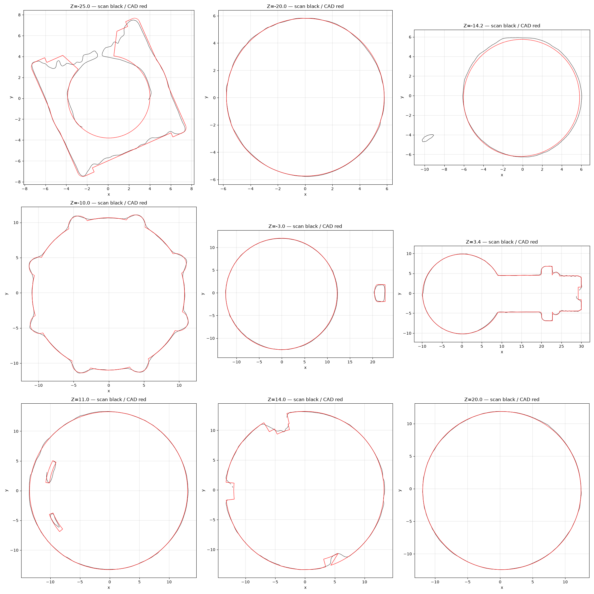

# OD-H21 Anti-drip valve — scan → STEP reverse-engineering report

| | |
|---|---|
| Part | `OD-H21` (ref 39, OEM 7313260161) — DeLonghi anti-drip valve (OD-H21): a turned plastic assembly with a snap nozzle and corner lugs, an 8-rib nut, bands, a body with a radial threaded outlet carrying an O-ring, a windowed cap ring and a hose barb on the cap. Scanned as one closed shell; the CAD is one fused solid of the outer envelope plus the observed openings. |
| Input | [`scans/OD-H21_antidrip_valve/OD-H21_antidrip_valve_raw.stl`](../../../scans/OD-H21_antidrip_valve/) — full-resolution scan |
| Method | staged pipeline — intake → measure → build (build123d) → independent verifier → deliver |
| Caliper data | **none** — scan-only; units assumed mm |
| Status | **Owner-reviewed and accepted** (`DECISIONS.md`, `decisions/`) — tracked in #41 |

**Full report: [`deliver/README.md`](deliver/README.md)** · verifier report: [`qa/VERDICT.md`](qa/VERDICT.md).

## Delivered STEP

[`step/OD-H21_antidrip_valve.step`](../../OD-H21_antidrip_valve.step) — **use in CAD**. Datum frame: band top face (the annular step where the body leaves the band ring) = Z 0, origin on the nozzle axis, +Z = nozzle axis, side outlet toward +X.

Same solid as the run's `build/OD-H21_antidrip-valve_datum.step`; only the STEP product / solid name was changed to `OD-H21 Anti-drip valve`, so sha256 values in `deliver/MANIFEST.json` refer to the run original. No scan-frame STEP is published — apply the inverse of `source/intake/alignment.json` to overlay the CAD on the raw scan.

Re-import check: 1 valid closed solid, 146 faces, volume 19,376.5 mm³, datum bbox 43.49 × 38.18 × 55.80 mm.

## Deviation (CAD ↔ scan)

| Direction | Measured |
|---|---|
| scan → CAD | p95 **0.175** / max 0.799 mm |
| CAD → scan (observable surface) | p95 0.255 / max 3.120 mm |

**Per zone:**

| Zone | Measured |
|---|---|
| I1 nozzle spigot OD lugs latch:scan_to_cad | p95 0.252 / max 0.799 |
| I1 nozzle spigot OD lugs latch:cad_to_scan | p95 0.293 / max 0.867 |
| I2 nozzle shoulder:scan_to_cad | p95 0.119 / max 0.202 |
| I2 nozzle shoulder:cad_to_scan | p95 0.206 / max 0.462 |
| I3 outlet thread and O-ring:scan_to_cad | p95 0.168 / max 0.720 |
| I3 outlet thread and O-ring:cad_to_scan | p95 0.190 / max 0.564 |
| I4 barb tube and bulb:scan_to_cad | p95 0.204 / max 0.775 |
| I4 barb tube and bulb:cad_to_scan | p95 0.163 / max 0.414 |
| I5 ring windows:scan_to_cad | p95 0.277 / max 0.562 |
| I5 ring windows:cad_to_scan | p95 0.453 / max 0.996 |

CAD → scan is dominated by surfaces the scanner never reached (bores, undersides, assembly interfaces); see `qa/VERDICT.md` for masks and clusters.

## Notes

- The run's reference photos were catalogue / web images and are **not redistributed**, so image links to `input/photos/` in the run documents are intentionally broken.
- Not copied from the run: meshes, STEP duplicates, NX files, deviation arrays and other files > 5 MB, superseded iterations.
- `deliverables/` of the run is at this folder's root; the run's `source/` (intake, measure, qa work files) is in [`source/`](source/).
