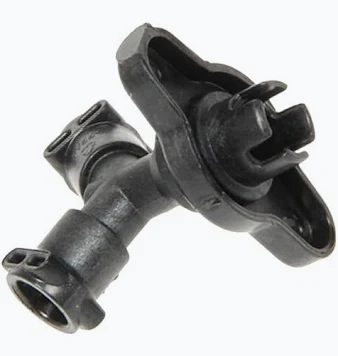

# OD-H22_3-way-valve — STL → STEP reverse-engineering delivery

**Verdict: `BAND_NOT_MET`** (from `qa/gate.json`; full reasoning in `qa/VERDICT.md`).  
**Band regime:** baseline-skill — source `baseline/skills/stl2step-build123d/SKILL.md:87`.  
**Iteration:** 1 of 3 (earlier iterations kept: none).  
**Verification independence (CHK-INDEP):** pass — fresh agent context, separate from the builder  

> **A deviation band was NOT met.** Delivered only under the recorded human acceptance below (by Ikbal (owner, decision card 11:48), 2026-09-25, record `decisions/accept_band.md`).

## 1. The part



A molded plastic 3-way valve body: a flange with an ear-hole pair, a crenellated drive tube and collar, a stem with gussets, and two Y-configured ports with clip blocks.

## 2. Deliverables

| file | frame | solids | valid | closed | faces | volume mm³ | bbox mm |
|---|---|---|---|---|---|---|---|
| `build/OD-H22_3-way-valve_datum.step` | datum | 1 | yes | yes | 162 | 6395.5936 | max: [20.931, 20.065, 13.68]; min: [-20.822, -19.8101, -30.873]; size: [41.753, 39.875, 44.553] |
| `build/OD-H22_3-way-valve.step` | scan | 1 | yes | yes | 162 | 6395.5936 | max: [24.5033, -25.5994, -190.2239]; min: [-15.5641, -66.9928, -238.4463]; size: [40.0674, 41.3934, 48.2224] |

Source of the table: `build/export_check.json`. The editable design intent is `build/model.py` driven by `measure/params.json`.

## 3. Method

1. Intake: aligned the raw scan to a datum frame (flange back face = z=0, valve axis = +Z, ear axis = +X) and declared mask M1 over the damaged +X ear tip.
2. Measure: derived params.json from the scan and photos, scan-only (no calipers supplied).
3. Build: build123d model.py built the part feature-by-feature (F01-F12) from params.json and exported datum-frame and scan-frame STEP.
4. Verify: an independent verifier re-registered scan to CAD by its own ICP, computed masked and unmasked scan->CAD and CAD->scan deviation, zones, and over-band clusters, and graded against the baseline-skill plastic band.
5. Deliver: packaged the verified, owner-accepted BAND_NOT_MET result with reproducibility re-run.

## 4. Coordinate frames

Two STEP files carry the same solid (SYNTHESIS D14): the **datum frame** (design frame, below) and the **scan frame** (the original STL coordinates; the CAD overlays the raw scan).

| element | definition | fit residual (rms / max mm) | why |
|---|---|---|---|
| origin | valve axis (median circle centre of boss collar, drive tube and stem neck ODs) ∩ flange back face plane | — | — |
| primary (plane) | flange plate back face (stem side, flat, ~290 mm2) | 0.0357 / 0.1086 | mounting flange seating face: the two screw ears clamp this flat against the machine; largest clean moulded flat, all other features stand off it |
| secondary (axis) | boss collar OD around the drive tube (tray side) + crenellated drive tube OD, lower unslotted band + stem neck OD below the flange | 0.0694 / 0.23 | collar concentric with the valve rotor axis; clean moulded circle / valve rotor/drive axis / same valve axis; extends the tilt span to ~16 mm |
| clock | fourier_mass: flange ear axis (screw-hole ears) -> +X (angle -84.9898°) | — | — |

Measured tilt: 0.4703° (common slope, per-feature intercept, 17 stations over 3 feature(s), z -11.800..6.400 vs frame Z; NOT RESOLVABLE (heuristic): 'crenellated drive tube OD, lower unslotted band' (0.56 deg @ -60.2 deg) vs 'stem neck OD below the flange' (0.52 deg @ -4.7 deg) differ by 0.51 deg > combined stderr 0.37 deg). Scale factor applied: 1. Scan noise floor: 0.0357 mm (rms of RANSAC+SVD plane on flange plate back face (stem side, flat, ~290 mm2) (8304 faces)).

Scan → datum matrix (row-major, `intake/alignment.json#matrix_4x4`); the scan-frame STEP uses its inverse:

```
 0.222223   0.973708  -0.050097   35.944170
-0.872040   0.175514  -0.456882  -87.776537
-0.436077   0.145216   0.888116   187.930701
 0.000000   0.000000   0.000000   1.000000
```

## 5. Parameters

Sources: assumed 4, scan 48 (total 52). Rendered from `measure/params.json`; never edited by hand.

| name | value | unit | measured | rule | source | ± mm | critical | evidence |
|---|---|---|---|---|---|---|---|---|
| `back_edge_R` | 1.868 | mm | 1.868 | keep-measured | scan | 0.04 | no | measure/figures/misc_meas.json#back_edge_round |
| `collar_R` | 8.06 | mm | 8.057 | round-within-noise | scan | 0.072 | no | measure/figures/fit_collar.json |
| `collar_top_z` | 4.73 | mm | 4.734 | round-within-noise | scan | 0.036 | no | measure/figures/core_meas.json#collar_top_z |
| `ear_end_R` | 5.484 | mm | 5.254..5.568 | keep-measured | scan | 0.036 | no | measure/figures/core_meas.json#ear_halfwidth_*, ear_tip_x_* |
| `ear_hole_r` | 1.936 | mm | [1.933, 1.939] | symmetry | scan | 0.036 | yes | measure/figures/core_meas.json#ear_hole_px/nx |
| `ear_hole_x` | [15.447, -15.338] | mm | [15.447, -15.338] | keep-measured | scan | 0.036 | yes | measure/figures/core_meas.json#ear_hole_px/nx |
| `ear_side_angle_deg` | 10.07 | deg | 10.07 | keep-measured | scan | 0.036 | no | measure/figures/core_meas.json#ear_halfwidth_* |
| `flange_floor_z` | 2.26 | mm | 2.262 | round-within-noise | scan | 0.036 | yes | measure/figures/core_meas.json#floor_z |
| `gusset_angle_deg` | 43.42 | deg | [43.924, 42.916] | mean-of-n | scan | 0.5 | no | measure/figures/core_meas.json#gusset_edge_* |
| `gusset_t` | 1.306 | mm | [1.247, 1.365] | mean-of-n | scan | 0.06 | no | measure/figures/core_meas.json#gusset_y_* |
| `gusset_x_at_z0` | 11.085 | mm | [11.014, 11.155] | mean-of-n | scan | 0.1 | no | measure/figures/core_meas.json#gusset_edge_* |
| `outline_blend_R` | 4.617 | mm | [4.887, 4.346] | mean-of-n | scan | 0.27 | no | measure/figures/misc_meas.json#outline_corner_* |
| `plate_R` | 11.7 | mm | 11.697 | round-within-noise | scan | 0.036 | no | measure/figures/core_meas.json#plate_central_R |
| `port_axis_z0` | [-14.301, -14.42] | mm | [-14.301, -14.42] | keep-measured | scan | 0.1 | no | measure/figures/ports_meas.json#*.axis_point_at_y0 |
| `port_block_corner_R` | 0.5 | mm | — | assumed | assumed | — | no | measure/figures/portsec_p.png |
| `port_block_half_u` | 5.891 | mm | [5.902, 5.88] | symmetry | scan | 0.036 | yes | measure/figures/ports_meas.json#*.block_half_u_p50 |
| `port_block_half_v` | 5.913 | mm | [5.915, 5.912] | symmetry | scan | 0.036 | yes | measure/figures/ports_meas.json#*.block_half_v_p50 |
| `port_block_t0` | [15.368, 15.077] | mm | [15.368, 15.077] | keep-measured | scan | 0.036 | no | measure/figures/ports_meas.json#*.t_block_start_p50 |
| `port_block_t1` | [19.022, 18.78] | mm | [19.022, 18.78] | keep-measured | scan | 0.036 | no | measure/figures/ports_meas.json#*.t_block_end_p50 |
| `port_bore2_R` | 3.557 | mm | 3.541..3.581 | keep-measured | scan | 0.05 | no | measure/figures/misc_meas.json#port_pY_bore_profile |
| `port_bore2_end_t` | 12.5 | mm | — | assumed | assumed | — | no | measure/figures/misc_meas.json#port_pY_bore_profile |
| `port_bore_R` | 4.339 | mm | [4.342, 4.337] | symmetry | scan | 0.036 | yes | measure/figures/ports_meas.json#*.bore_r_p50 |
| `port_bore_step_t` | 16.445 | mm | 16.445 | keep-measured | scan | 0.2 | no | measure/figures/misc_meas.json#port_pY_bore_step_t |
| `port_elev_deg` | [34.059, 35.03] | deg | [34.059, 35.03] | keep-measured | scan | 0.3 | yes | measure/figures/ports_meas.json#*.axis_dir |
| `port_end_t` | [20.054, 19.873] | mm | [20.054, 19.873] | keep-measured | scan | 0.036 | yes | measure/figures/ports_meas.json#*.t_end_p50 |
| `port_lip_R` | 6.162 | mm | [6.164, 6.159] | symmetry | scan | 0.036 | yes | measure/figures/ports_meas.json#*.lip_R_p50 |
| `port_neck_R` | 4.173 | mm | [4.178, 4.168] | symmetry | scan | 0.036 | no | measure/figures/ports_meas.json#*.neck_R_p50 |
| `port_sleeve_R` | 5.585 | mm | [5.578, 5.592] | symmetry | scan | 0.036 | no | measure/figures/ports_meas.json#*.sleeve_R_p50 |
| `port_sleeve_t` | [7.25, 6.85] | mm | [7.25, 6.85] | keep-measured | scan | 0.1 | no | measure/figures/ports_meas.json#*.t_sleeve_start |
| `port_slot_dt0` | 1.161 | mm | [1.152, 1.17] | symmetry | scan | 0.036 | no | measure/figures/ports_meas.json#*.slot_wall_t_lo_p50 |
| `port_slot_v_in` | 0.932 | mm | [0.957, 0.907] | symmetry | scan | 0.036 | no | measure/figures/ports_meas.json#*.slot_v_inner_p50 |
| `port_slot_v_out` | 4.72 | mm | [4.739, 4.701] | symmetry | scan | 0.036 | no | measure/figures/ports_meas.json#*.slot_v_outer_p50 |
| `port_slot_w` | 1.353 | mm | [1.354, 1.352] | symmetry | scan | 0.036 | yes | measure/figures/ports_meas.json#*.slot_wall_t_* |
| `rib_bottom_z` | -23.696 | mm | -23.696 | keep-measured | scan | 0.036 | no | measure/figures/core_meas.json#rib_bottom_z |
| `rib_half_len` | 4.5 | mm | — | assumed | assumed | — | no | measure/figures/sec_x0_zoom.png |
| `rib_t` | 1.624 | mm | 1.624 | keep-measured | scan | 0.08 | no | measure/figures/core_meas.json#rib_x |
| `rim_top_z` | 5.63 | mm | 5.63 | round-within-noise | scan | 0.036 | no | measure/figures/core_meas.json#rim_top_z |
| `rim_wall_t` | 1.447 | mm | [1.42, 1.444, 1.446, 1.478] | mean-of-n | scan | 0.036 | no | measure/figures/core_meas.json#rim_inner_* |
| `slot_bottom_z_x` | 8.912 | mm | [8.907, 8.918] | symmetry | scan | 0.036 | no | measure/figures/core_meas.json#slot_bottom_z_* |
| `slot_bottom_z_y` | 8.704 | mm | [8.691, 8.717] | symmetry | scan | 0.036 | no | measure/figures/core_meas.json#slot_bottom_z_* |
| `slot_count` | 4 | count | 4 | keep-measured | scan | 0 | no | measure/figures/count_tube_slots.json |
| `slot_theta_deg` | [-0.11, 90.2, 179.79, 269.38] | deg | [-0.11, 90.2, 179.79, 269.38] | keep-measured | scan | 0.036 | yes | measure/figures/core_meas.json#slot_walls |
| `slot_w` | [3.086, 2.722, 3.041, 2.572] | mm | [3.086, 2.722, 3.041, 2.572] | keep-measured | scan | 0.036 | yes | measure/figures/core_meas.json#slot_walls |
| `stem_R` | 6.547 | mm | [6.538, 6.547, 6.55, 6.552] | mean-of-n | scan | 0.045 | no | measure/figures/stem_meas.json |
| `stem_cone_half_angle_deg` | 40.09 | deg | 40.09 | keep-measured | scan | 0.036 | no | measure/figures/core_meas.json#stem_r_at_z* |
| `stem_cone_top_z` | -4.234 | mm | -4.234 | keep-measured | scan | 0.1 | no | measure/figures/core_meas.json#stem_r_at_z* |
| `stem_neck_R` | 4.074 | mm | 4.074 | keep-measured | scan | 0.075 | no | measure/figures/fit_stem_neck.json |
| `stem_neck_bottom_z` | -19.587 | mm | -19.587 | keep-measured | scan | 0.036 | no | measure/figures/stembot_meas.json |
| `tube_R` | 6.203 | mm | 6.203 | keep-measured | scan | 0.074 | yes | measure/figures/fit_tube_od.json |
| `tube_bore_bottom_z` | 1.5 | mm | — | assumed | assumed | — | no | intake/coverage.json; intake/INTAKE_CARD.md E07 |
| `tube_bore_r` | 4.561 | mm | 4.561 | keep-measured | scan | 0.101 | yes | measure/figures/fit_tube_bore.json |
| `tube_top_z` | 13.68 | mm | 13.682 | round-within-noise | scan | 0.15 | yes | measure/figures/core_meas.json#tube_top_z |

## 6. Model tree (design intent)

The STEP is a neutral B-Rep; it carries no feature history. The editable design intent is `build/model.py` driven by `measure/params.json`, and the ordered feature plan is `build/MODELING_PLAN.md`.

_No `feature_tree` was declared in `deliver/limitations.json`; see `build/MODELING_PLAN.md` for the ordered feature plan._

## 7. Tier-1 — caliper dims re-measured on the STEP

**Tier-1 not run: no caliper dimensions exist.** Every dimension is scan authority (or operator spec); see the source column in §5. Absent is not passed.

## 8. Deviation gate (scan ↔ CAD)

Regime **baseline-skill** (`baseline/skills/stl2step-build123d/SKILL.md:87`); bands: p95_mm: 0.3; max_mm: 0.8; tier1_abs_mm: —; interface_max_mm: —.

Registration: point-to-point ICP, CAD samples -> scan samples, masked correspondences (B02 q20_tier2.py), iterations 33/60, converged yes, correction 0.3837° / 0.0143 mm.  
Unobservable CAD fraction: 0.0044.

| direction | n | rms | p50 | p95 | p99 | max | sampling | source |
|---|---|---|---|---|---|---|---|---|
| scan → CAD **unmasked** | 249510 | 0.1325 | 0.0677 | 0.2483 | 0.4446 | 1.4269 | — | `qa/gate.json#deviation` |
| scan → CAD (masked) | 245229 | 0.1204 | 0.0667 | 0.2349 | 0.3896 | 1.4269 | — | `qa/gate.json#deviation` |
| CAD → scan **unmasked** (all) | 300000 | 0.6213 | 0.0773 | 1.5475 | 3.0232 | 5.1657 | — | `qa/gate.json#deviation` |
| CAD → scan (masked) | 249902 | 0.4782 | 0.0678 | 0.3941 | 2.625 | 5.1657 | — | `qa/gate.json#deviation` |
| CAD → scan (observable) | 19911 | 0.6032 | 0.0776 | 1.4843 | 2.9257 | 4.858 | — | `qa/gate.json#deviation` |

### Gate results (what the verdict was graded on)

| item | band | measured | result |
|---|---|---|---|
| scan_to_cad:masked | p95 ≤0.3 / max ≤0.8 | p95 0.2349 max 1.4269 (n 245229) | FAIL |
| cad_to_scan_observable | p95 ≤0.3 / max ≤0.8 | p95 1.4843 max 4.858 (n 19911) | FAIL |

### Per zone (unmasked and masked side by side)

| zone | kind | direction | unmasked | masked | unmasked stats | masked stats | note |
|---|---|---|---|---|---|---|---|
| B1 z above 5.7 (tube) | region | scan_to_cad | reported | reported | n 34384 · p95 0.2491 · max 0.7778 | n 34378 · p95 0.2489 · max 0.7778 | — |
| B1 z above 5.7 (tube) | region | cad_to_scan | reported | reported | n 29990 · p95 0.2544 · max 0.6924 | n 28930 · p95 0.2507 · max 0.6924 | — |
| B2 z 0..5.7 (plate, tray, collar) | region | scan_to_cad | reported | reported | n 97682 · p95 0.2553 · max 1.4269 | n 93407 · p95 0.2192 · max 1.4269 | — |
| B2 z 0..5.7 (plate, tray, collar) | region | cad_to_scan | reported | reported | n 115785 · p95 1.1484 · max 4.858 | n 98940 · p95 0.2339 · max 4.1936 | — |
| B3 z -12..0 (stem, gussets) | region | scan_to_cad | reported | reported | n 27071 · p95 0.1773 · max 0.4973 | n 27071 · p95 0.1773 · max 0.4973 | — |
| B3 z -12..0 (stem, gussets) | region | cad_to_scan | reported | reported | n 27991 · p95 0.4693 · max 1.7145 | n 23993 · p95 0.1729 · max 1.7145 | — |
| B4 z below -12 (junction, ports) | region | scan_to_cad | reported | reported | n 90373 · p95 0.2662 · max 0.675 | n 90373 · p95 0.2662 · max 0.675 | — |
| B4 z below -12 (junction, ports) | region | cad_to_scan | reported | reported | n 126234 · p95 1.9996 · max 5.1657 | n 98039 · p95 2.0007 · max 5.1657 | — |
| I1 drive tube bore lower (occluded) | interior | scan_to_cad | reported | reported | n 3715 · p95 0.2337 · max 0.3912 | n 3715 · p95 0.2337 · max 0.3912 | INTAKE_CARD §3: bore wall open below z~1.5-1.9, floor/web not scanned; reported only |
| I1 drive tube bore lower (occluded) | interior | cad_to_scan | reported | reported | n 12095 · p95 3.655 · max 4.858 | n 2810 · p95 3.23 · max 4.1936 | INTAKE_CARD §3: bore wall open below z~1.5-1.9, floor/web not scanned; reported only |
| Z1 flange back face and ear holes | functional_interface | scan_to_cad | reported | reported | n 15913 · p95 0.1727 · max 1.4269 | n 15913 · p95 0.1727 · max 1.4269 | INTAKE_CARD §4 Z1 mounting seat + screw-ear hole walls; baseline-skill has no interface band -> reported |
| Z1 flange back face and ear holes | functional_interface | cad_to_scan | reported | reported | n 21498 · p95 0.1948 · max 0.9463 | n 18947 · p95 0.1444 · max 0.5178 | INTAKE_CARD §4 Z1 mounting seat + screw-ear hole walls; baseline-skill has no interface band -> reported |
| Z2 drive tube and collar | functional_interface | scan_to_cad | reported | reported | n 48452 · p95 0.2228 · max 0.4641 | n 48452 · p95 0.2228 · max 0.4641 | INTAKE_CARD §4 Z2 knob/rotor drive interface: boss collar, tube OD, bore, 4 slots |
| Z2 drive tube and collar | functional_interface | cad_to_scan | reported | reported | n 54533 · p95 2.5332 · max 4.858 | n 44614 · p95 0.2711 · max 4.1936 | INTAKE_CARD §4 Z2 knob/rotor drive interface: boss collar, tube OD, bore, 4 slots |
| Z3 ports clip blocks and bores | functional_interface | scan_to_cad | reported | reported | n 63062 · p95 0.2994 · max 0.675 | n 63062 · p95 0.2994 · max 0.675 | INTAKE_CARD §4 Z3 hose ports: neck, sleeve, clip block+slots, lip, bore |
| Z3 ports clip blocks and bores | functional_interface | cad_to_scan | reported | reported | n 92174 · p95 2.0635 · max 5.1657 | n 64907 · p95 2.0789 · max 5.1657 | INTAKE_CARD §4 Z3 hose ports: neck, sleeve, clip block+slots, lip, bore |
| Z4 stem junction gussets tray rim | region | scan_to_cad | reported | reported | n 122083 · p95 0.2469 · max 1.419 | n 117802 · p95 0.2194 · max 1.419 | INTAKE_CARD §4 Z4 structural/cosmetic (remainder of the part) |
| Z4 stem junction gussets tray rim | region | cad_to_scan | reported | reported | n 131795 · p95 0.2616 · max 1.7145 | n 121434 · p95 0.2187 · max 1.7145 | INTAKE_CARD §4 Z4 structural/cosmetic (remainder of the part) |

### Masks (masked and unmasked are both shown above)

| mask | direction | why | fraction removed | stats inside |
|---|---|---|---|---|
| M1 damaged +X ear tip | scan_to_cad | the +X ear tip of this specimen is damaged/torn (jagged outline); the CAD follows the undamaged -X ear by symmetry, so deviation here is specimen damage, not a surface deviation of the modelled design | 0.0172 | n: 4281; rms: 0.44; mean: 0.3295; p50: 0.2343; p95: 0.9655; p99: 1.1958; max: 1.2756 |
| M1 damaged +X ear tip | cad_to_scan | the +X ear tip of this specimen is damaged/torn (jagged outline); the CAD follows the undamaged -X ear by symmetry, so deviation here is specimen damage, not a surface deviation of the modelled design | 0.0049 | n: 1470; rms: 0.2071; mean: 0.1679; p50: 0.1394; p95: 0.4221; p99: 0.4819; max: 0.5276 |
| M2 open boundary | cad_to_scan | distance from a CAD point to a scan hole EDGE (unscanned bore interiors, 28 open loops) is not a surface deviation | 0.1625 | n: 48757; rms: 1.0963; mean: 0.6767; p50: 0.2913; p95: 2.5639; p99: 3.8914; max: 5.0303 |

### Mask sensitivity

| band | direction | stats | variant |
|---|---|---|---|
| p95_band: 0.3; max_band: 0.8; pass: no; max_over_by: 0.6269 | scan_to_cad | n: 249510; rms: 0.1325; mean: 0.0914; p50: 0.0677; p95: 0.2483; p99: 0.4446; max: 1.4269 | all masks except M1 damaged +X ear tip |
| p95_band: 0.3; max_band: 0.8; pass: no; p95_over_by: 0.0957; max_over_by: 4.3657 | cad_to_scan | n: 251243; rms: 0.4772; mean: 0.1688; p50: 0.068; p95: 0.3957; p99: 2.6225; max: 5.1657 | all masks except M1 damaged +X ear tip |
| p95_band: 0.3; max_band: 0.8; pass: no; p95_over_by: 1.2588; max_over_by: 4.3657 | cad_to_scan | n: 298530; rms: 0.6227; mean: 0.2518; p50: 0.077; p95: 1.5588; p99: 3.0279; max: 5.1657 | all masks except M2 open boundary |
| p95_band: 0.3; max_band: 0.8; pass: no; p95_over_by: 0.2344; max_over_by: 4.3657 | cad_to_scan | n: 280127; rms: 0.4803; mean: 0.1793; p50: 0.0712; p95: 0.5344; p99: 2.5903; max: 5.1657 | M2 open boundary radius 0.0 mm |
| p95_band: 0.3; max_band: 0.8; pass: no; p95_over_by: 0.0994; max_over_by: 4.3657 | cad_to_scan | n: 266286; rms: 0.4709; mean: 0.1676; p50: 0.0684; p95: 0.3994; p99: 2.5988; max: 5.1657 | M2 open boundary radius 0.2 mm |
| p95_band: 0.3; max_band: 0.8; pass: no; p95_over_by: 0.0906; max_over_by: 4.3657 | cad_to_scan | n: 260617; rms: 0.4735; mean: 0.1675; p50: 0.068; p95: 0.3906; p99: 2.6177; max: 5.1657 | M2 open boundary radius 0.4 mm |
| p95_band: 0.3; max_band: 0.8; pass: no; p95_over_by: 0.0941; max_over_by: 4.3657 | cad_to_scan | n: 249902; rms: 0.4782; mean: 0.1688; p50: 0.0678; p95: 0.3941; p99: 2.625; max: 5.1657 | M2 open boundary radius 0.8 mm |
| p95_band: 0.3; max_band: 0.8; pass: no; p95_over_by: 0.0863; max_over_by: 4.3657 | cad_to_scan | n: 223749; rms: 0.4945; mean: 0.173; p50: 0.0673; p95: 0.3863; p99: 2.6807; max: 5.1657 | M2 open boundary radius 1.5 mm |
| p95_band: 0.3; max_band: 0.8; pass: no; p95_over_by: 0.032; max_over_by: 4.3657 | cad_to_scan | n: 169520; rms: 0.5094; mean: 0.1714; p50: 0.0654; p95: 0.332; p99: 2.8151; max: 5.1657 | M2 open boundary radius 2.5 mm |

### Over-band point clusters, scan → CAD (> 0.8 mm)

564 points (0.0023 fraction) in 3 clusters ≥ 20 pts.

| # | n | centroid | r range | θ range (deg) | d max | explanation |
|---|---|---|---|---|---|---|
| 0 | 278 | [21.196, -3.049, 3.985] | [21.047, 21.668] | [350.7, 354.2] | 1.2756 | +X ear tip, scan beyond the CAD (x 20.8-21.5, y -3.4..-2.2, z 2.3-5.2; 278 pts, max 1.28). This is the region intake pre-declared as damaged (inside mask M1). photo_4 suggests it may be a real pip; see CHK-ENUM. It does not drive the max (the masked max is the same) |
| 1 | 156 | [20.811, 3.487, 4.209] | [20.866, 21.219] | [8.7, 10.2] | 1.0461 | +X ear tip, other side (x 20.5-20.9, y 3.2-3.7, z 2.9-5.4; 156 pts, max 1.05). Same cause as cluster 0 (inside M1) |
| 2 | 130 | [16.212, -0.218, 0.274] | [15.948, 16.545] | [0.1, 360] | 1.4269 | scan material inside the +X ear screw hole at the back face (x 15.9-16.5, y -0.8..0.6, z 0.05-0.56; 130 pts, max 1.43). Photos show both ear holes open through; the -X hole has no such material. Probably scanner bridging/fuzz over the small hole mouth (flash cannot be ruled out). Not pre-declared, so not masked. This cluster sets the whole-part scan->CAD max |

### Over-band point clusters, CAD → scan (> 0.8 mm)

23094 points (0.077 fraction) in 8 clusters ≥ 20 pts.

| # | n | centroid | r range | θ range (deg) | d max | explanation |
|---|---|---|---|---|---|---|
| 0 | 9293 | [0.06, -12.133, -22.501] | [8.203, 17.388] | [249, 293.4] | 5.1657 | **UNEXPLAINED** |
| 1 | 6564 | [-0.638, -0.243, 2.139] | [0.058, 4.561] | [0.1, 359.8] | 4.858 | **UNEXPLAINED** |
| 2 | 6086 | [0.82, 11.077, -23.224] | [8.369, 15.627] | [70.7, 109.3] | 4.3784 | **UNEXPLAINED** |
| 3 | 732 | [5.91, -2.282, -1.084] | [6.546, 8.81] | [277.7, 355.7] | 1.7145 | **UNEXPLAINED** |
| 4 | 227 | [-3.656, 16.619, -20.199] | [16.212, 17.656] | [97.6, 106.3] | 1.3701 | **UNEXPLAINED** |
| 5 | 61 | [3.978, 16.717, -20.228] | [16.357, 17.579] | [74.3, 79.8] | 1.0327 | **UNEXPLAINED** |
| 6 | 45 | [-7.735, -0.653, -1.234] | [7.306, 8.328] | [184.5, 185.1] | 1.0938 | **UNEXPLAINED** |
| 7 | 37 | [0.354, -10.245, 3.786] | [10.252, 10.253] | [269.8, 273.7] | 1.0529 | **UNEXPLAINED** |

**Datum audit (report-only, QUESTIONS Q2):** angle 0.2162°, origin offset 0.0458 mm, point disagreement p95 0.1053 mm; reference band ≤0.3° / ≤0.15 mm (RE_SPEC.md:241) (within).

## 9. Band miss: where and what next

| region | cause | options |
|---|---|---|
| VERDICT BASIS (why BAND_NOT_MET): whole part | This is an OFFICIAL full-res grade: the owner confirmed on 2026-09-25 11:41 that the scan is full resolution. ICP converged and the solid is valid. Two gated bands miss: scan->CAD masked max, and observable CAD->scan p95 and max. Both misses come from one scan artefact and from interiors the scanner did not reach, not from geometry a rebuild could correct. REVISE would therefore spend a loop without new data, and nothing here needs a HALT. | Deliver as-is: needs a DECISIONS.md ACCEPT-BAND entry from the owner that cites this gate.json by sha256 prefix or created time, names a missed band (scan_to_cad and/or cad_to_scan_observable), and points to an evidence file outside qa/ build/ measure/ intake/ deliver/ (e.g. decisions/accept_band.md). Or supply data (rescan of the bores, calipers, specimen inspection of the +X ear hole) and then run a measure-route loop 2. |
| +X ear screw hole, back-face mouth (scan->CAD cluster 2) | scan->CAD max 1.427 > 0.80: 130 scan points lie inside a through hole that photos show as open. Probable scan bridging artefact, not a CAD omission. The rest of scan->CAD is within the band (masked p95 0.235). | (a) owner accepts it as an artefact via an ACCEPT-BAND entry citing this gate; (b) inspect the specimen for flash in the +X hole; (c) declare an artefact mask in DECISIONS before a re-grade. That would be a declared mask-dependent result, never silent |
| drive-tube bore lower + floor (CAD->scan cluster 1, 6,564 pts, max 4.86) | the scan is open below z~1.5-1.9 inside the bore, so the CAD bore floor/web has no scan behind it (INTAKE_CARD §3). Geometry cannot be checked there, and a rebuild cannot fix it without data. | rescan the bore, caliper the tube depth, or accept it as a coverage limitation |
| port bores and clip-slot interiors (CAD->scan clusters 0, 2, 4, 5; ~15,700 pts, max 5.17) | port bores beyond t~13-16 and slot interiors were not scanned (INTAKE_CARD §3). CAD bore walls there are assumed, and photo_4 hints at internal structure. | rescan or section a port; caliper the bore diameter/depth; or accept as unobservable |
| stem/gusset root and tray rim -Y (CAD->scan clusters 3, 6, 7; ~800 pts, max 1.71) | small scan holes at the gusset roots (INTAKE_CARD §3 'small holes at gusset root') and a local gap on the inner tray rim. The CAD surface has no scan behind it there. | rescan these areas, or accept as a coverage limitation |

Missed band(s): `scan_to_cad:masked: p95 0.235 max 1.427 vs 0.3/0.8`; `cad_to_scan_observable: p95 1.484 max 4.858 vs 0.3/0.8`.

## 10. Named checks

| check | stage | ran | result | note |
|---|---|---|---|---|
| CHK-ACHIEVABLE | verify (`qa/gate.json#checks`) | yes | n/a | no Tier-1 (no calipers) |
| CHK-CIRCULAR | verify (`qa/gate.json#checks`) | yes | pass | QA ICP registers the builder CAD onto the raw scan through intake/alignment.json. T_refine is QA-only and was not written back. No expected value was taken from builder params. The datum was not ICP'd to its own CAD. The builder's own self-check was not consulted for grading |
| CHK-CLUSTER | verify (`qa/gate.json#checks`) | yes | pass | 3 scan->CAD over-band clusters; unexplained: [] |
| CHK-ENUM | verify (`qa/gate.json#checks`) | yes | finding | Intake features E01-E14 appear in both CAD and scan (overlays). Findings: (a) photo_4 shows a round pip/lump at the right ear tip. The scan also has a lump beyond the CAD at the +X ear tip (clusters 0,1). Intake declared this as damage and masked it (M1), but it may be a real feature. (b) photo_4 shows internal structure inside a port mouth. That area is unscanned, and the CAD models a plain bore (assumed) |
| CHK-FILLET | verify (`qa/gate.json#checks`) | yes | pass | build/export_check.json fillets: 5/5 OK, target == used (4.617, 1.868, 6.064, 0.5, 0.5) |
| CHK-INDEP | verify (`qa/gate.json#checks`) | yes | pass | fresh agent context, separate from the builder |
| CHK-LIKE4LIKE | verify (`qa/gate.json#checks`) | yes | n/a | iteration 1; no _itN_SUPERSEDED to compare |
| CHK-MASK | verify (`qa/gate.json#checks`) | yes | pass | no pass depends on a mask |
| CHK-OVERLAY | verify (`qa/gate.json#checks`) | yes | pass | every panel shows scan |
| CHK-PATCHWORK | verify (`qa/gate.json#checks`) | yes | pass | census: 162 faces (plane 93, cylinder 60, torus 8, cone 1), 100% analytic area, no B-spline. MODELING_PLAN.md:57 and model.py have no loft/ruled/polyline stack |
| PHOTO-PLAUSIBILITY | verify (`qa/gate.json#checks`) | yes | finding | photos 1-4 checked: plate, ears and through holes, tray rim, crenellated drive tube (4 slots), stem, gussets, Y ports, clip blocks with 2 slots, and lips are all in the CAD. Nothing in the CAD is absent from both photos and scan. Open points: the ear-tip pip and the port-internal structure, as in CHK-ENUM |
| CHK-PUBLISH | deliver (preflight) | yes | pass | verdict BAND_NOT_MET |
| CHK-SUPERSEDED | deliver (preflight) | yes | pass | all earlier iterations kept intact |
| inputs_unchanged | deliver (preflight) | yes | pass | 5 input file(s) unchanged |
| hash_frozen | deliver (preflight) | yes | pass | every build/ STEP matches hash_frozen |
| regime_declared | deliver (preflight) | yes | pass | regime 'baseline-skill' |

## 11. Declared limitations (each with its re-run trigger)

| id | limitation | re-run trigger | evidence |
|---|---|---|---|
| L1 | ABSENT: no Tier-1 (no calipers run); no calipers were supplied. Absolute scale is UNVERIFIED (not caliper-checked). | any caliper reading (e.g. drive tube OD, ear hole pitch) | DECISIONS.md MEASUREMENTS |
| L2 | NOT MET: scan->CAD masked max 1.4269 exceeds the 0.8 mm band. The whole-part scan->CAD p95 0.2483 is within the 0.3 mm band. The max miss is set by 130 scan points inside the +X ear screw hole back-face mouth, which photos show as an open through hole -- probable scanner bridging/fuzz over the small hole mouth, not a CAD omission. Owner accepted this miss (DECISIONS.md ACCEPT-BAND). | specimen inspection of the +X ear hole for flash, or a declared artefact mask before a re-grade | qa/VERDICT.md#Over-band scan->CAD points; decisions/accept_band.md |
| L3 | ASSUMED: Unscanned interiors are assumed geometry -- the drive-tube bore floor/lower bore, port bores beyond t~13-16, clip-slot interiors, the stem/gusset root coverage hole, and the internal flow passages. NOT MET: observable CAD->scan p95 1.4843 and max 4.858 exceed the 0.3/0.8 mm band because the ray test counts these open-mouthed bores as observable (unobservable fraction only 0.0044%). A rebuild without new data cannot fix this. Owner accepted this miss (DECISIONS.md ACCEPT-BAND). | rescan covering the bores, or a sectioned/caliper measurement of bore depths and the tube floor | qa/gate.json#limitations[1]; decisions/accept_band.md |
| L4 | PHOTO-INFERRED, unconfirmed: Mask M1 (+X ear tip, pre-declared at intake as damage) rests on an unconfirmed premise -- photo_4 shows a pip at an ear tip. Unmasked and masked scan->CAD max are identical, so M1 does not change any result. | operator confirms whether the +X ear-tip lump is damage or a moulded feature | qa/gate.json#limitations[2]; input/photos/photo_4.png |
| L5 | ASSUMED params: tube_bore_bottom_z, port_block_corner_R, port_bore2_end_t and rib_half_len are assumed (not measured), because the corresponding regions were not scanned or calipered. | a rescan or caliper reading covering any of these regions | measure/params.json |

## 12. Assumptions and invented geometry

Parameters not measured on the scan or by caliper (source tag from `measure/params.json`):

| parameter | value | source | evidence |
|---|---|---|---|
| `port_block_corner_R` | 0.5 | assumed | measure/figures/portsec_p.png |
| `port_bore2_end_t` | 12.5 | assumed | measure/figures/misc_meas.json#port_pY_bore_profile |
| `rib_half_len` | 4.5 | assumed | measure/figures/sec_x0_zoom.png |
| `tube_bore_bottom_z` | 1.5 | assumed | intake/coverage.json; intake/INTAKE_CARD.md E07 |

- The drive-tube bore floor, lower bore, port bores beyond t~13-16, clip-slot interiors, the stem/gusset root coverage hole and internal flow passages are assumed geometry, not measured. _(source: assumed; qa/VERDICT.md#Misses, per region; measure/params.json)_
- tube_bore_bottom_z, port_block_corner_R, port_bore2_end_t and rib_half_len are assumed values. _(source: assumed; measure/params.json)_
- The +X ear-tip lump seen in photo_4 is treated as specimen damage (mask M1), not a moulded feature; this is unconfirmed. _(source: photo-inferred; qa/VERDICT.md#Masks; input/photos/photo_4.png)_

## 13. Claim boundary — what this result is NOT

- **Not fit for:** Not fit for manufacture or tooling until the unscanned bores and the tube floor are measured (caliper or rescan) and the +X ear hole is inspected for flash.
- **Not fit for:** Not fit for hose, clip or drive-spline fit decisions until bore and interior dimensions are caliper-verified.
- **Not fit for:** Not fit for absolute-scale-critical use: no caliper reading has verified scale.
- Fit for: Envelope, packaging and clearance work, and visualization: the scan->CAD p95 0.2483 shows the outer skin the scanner saw matches the model within the 0.3 mm band.
- Fit for: Design-intent reference for the flange, ears, drive tube, collar, stem, gussets, ports and clip blocks.
- The verdict covers only the Tier-1, deviation and named-check gates above, under the **baseline-skill** regime.

- Verify's own claim boundary (`qa/gate.json#claim_boundary`): Official full-res grade. Scan->CAD p95 is within the band, so the outer skin the scanner saw matches. Bore interiors, the tube floor, the flow passages and absolute scale are unverified (no calipers). Not fit for tooling or for hose, clip or drive-spline fit decisions until the bores are measured.

## 14. Human acceptance of the band miss

Accepted by **Ikbal (owner, decision card 11:48)** on 2026-09-25 (`DECISIONS.md`, ACCEPT-BAND): Accept and deliver: accepts scan_to_cad and cad_to_scan_observable band misses, gate 89a14a86f4d4 (created 2026-09-25T11:45:11+00:00); scan->CAD p95 0.235 passes <=0.30, max 1.43 vs <=0.80 from stray scan material inside the open +X ear hole, CAD->scan p95 1.48 fails from unreached bores, a rebuild without new data cannot fix either miss.. Record: `decisions/accept_band.md` (sha256 `a0ed28f510488701f2d4c4b5e9cc23535d9f8aa2e3ac0cfe4f713312889c750a`).

## 15. Reproduction

```
python3 model.py --params ../measure/params.json --alignment ../intake/alignment.json --out . --part OD-H22_3-way-valve --scripts <stl-re-rebuild-build123d>/scripts
```

Fresh-process rebuild check (`deliver/repro.json`): reproducible **yes**; method 2 fresh subprocess rebuild(s) of build/model.py in a scratch copy; STEP re-imported; solids, faces, surface census, volume, bbox compared (raw hash reported, not required); environment python: 3.11.15; platform: Linux-6.18.44-fc-v37-x86_64-with-glibc2.39; build123d: 0.13.0; OCP: 8.0.1.0; numpy: 2.4.6.

| file | volume mm³ | |Δ volume| | max |Δ bbox| | faces equal | identical | raw sha equal |
|---|---|---|---|---|---|---|
| OD-H22_3-way-valve.step | 6395.5936 | 0 | 0 | yes | yes | no |
| OD-H22_3-way-valve_datum.step | 6395.5936 | 0 | 0 | yes | yes | no |

_Raw STEP hashes differ between runs because STEP headers carry a timestamp; the geometry is compared._

## 16. Provenance of every number in this file

| file | sha256 |
|---|---|
| `qa/gate.json` | 89a14a86f4d4880e036cd1a47f20416782db9419d725f667f0a01825618ef557 |
| `measure/params.json` | 2e8f4dafed0892b59b70ffa463751eb6bfe480df0ebec3b29801f6cd5c06eb82 |
| `build/export_check.json` | 4ab829a6109ac646b0fcd64a8d7267bfc47bb4b0322372213c9a5459f26aaf64 |
| `intake/alignment.json` | 81c7bf4635456e8c66d025e9c3aeff849e9e9604ddbee48ba8a59335f860930a |
| `deliver/repro.json` | e3724fa2d3f7005057d72ad49e60b952460269f3fbc1c8a7bec84de5a91501b1 |
| `deliver/limitations.json` | c28b3bd389e9e792c40e677798a30a8c824471c69d017fdf2b6cc29d867bd44b |

Generated by `stl-re-deliver/scripts/make_readme.py`. Do not edit numbers by hand; fix the JSON and re-render.
