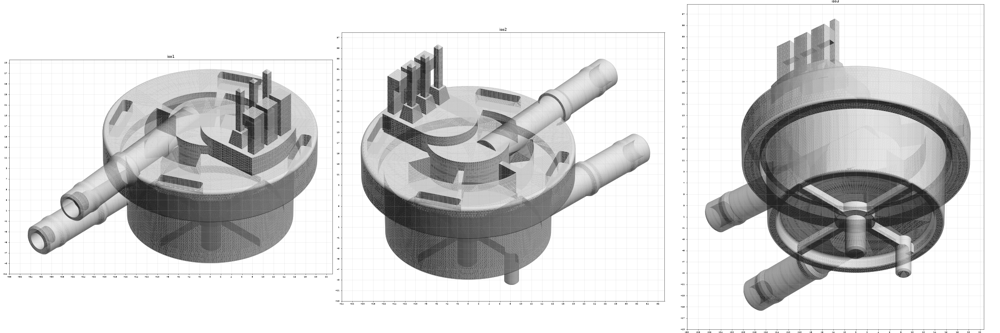

# OD-H24 Flowmeter — scan → STEP reverse-engineering report (feature-based)



| | |
|---|---|
| Part | `OD-H24` (ref 45, OEM 5213225251) — turbine flowmeter body (Hall-sensor pulse output) |
| Input | [`scans/OD-H24_flowmeter/OD-H24_flowmeter_raw.stl`](../../../scans/OD-H24_flowmeter/) — 984 209 triangles, not watertight |
| Method | trimesh datum / measurement → build123d feature tree (revolve / extrude / taper-extrude / cut / fillet / chamfer), 69 named parameters from the scan, two-way deviation gate. Same approach as [`OD-H01`](../OD-H01_ulka_ep5_pump/) and [`OD-H11`](../OD-H11_thermoblock/). |
| Caliper data | **none yet** — every dimension comes from the scan |

## Deliverables

| File | Content |
|---|---|
| [`step/OD-H24_flowmeter.step`](../../OD-H24_flowmeter.step) | **Use this for CAD.** Datum frame: Z = cup axis (LSQ from wall normals, checked on 10 sections, centre drift ≤ 0.05 mm), Z = 0 on the bottom rim face, inlet (lower) pipe runs −Y. |
| [`step/OD-H24_flowmeter_scanframe.step`](../../OD-H24_flowmeter_scanframe.step) | Same solid in the original scan coordinates (sits exactly on the raw STL). |
| `*.json`, `*.png` | Parameters, export / flat checks, deviation report, CAD and scan views, section overlays, signed deviation map |
| `src/` | `build_fm.py` (feature tree), `export_final.py`, `export_flat.py`, `gate_fm.py`, `overlay.py`, `T.npy` (4×4 scan → datum), `tubes.json`, `measure/` (datum + measurement scripts) |

**Flat STEP:** both files are single-product, no assembly node (`NEXT_ASSEMBLY_USAGE_OCCURRENCE` = 0), so NX / SolidWorks open the solid directly in the part instead of as a sub-component.

Re-import check: **1 manifold solid, 1 closed shell, no voids, valid, 203 faces** (134 plane, 47 cylinder, 14 cone, 8 torus, **no B-splines**), volume 19 858.9 mm³, area 7 919.7 mm², 0.9 MB. Datum bbox 40.72 × 57.07 × 43.53 mm.

## Feature tree (design intent — values in [`params.json`](params.json))

1. **Body revolve** — base panel z 2.0; rim inner r 13.98, rim face z 0; drafted cup r 15.71 + 0.0195·z (~1.1°); cup-to-skirt gap r 15.99 → 17.1 (top z 14.7); flange underside z 12.67, outer r 20.25 → 20.37, top z 19.90; centre hub r 7.95, top z 21.87; fillets 0.3–0.6.
2. **Base ribs** — Ø7.18 hub disc, 4 radial ribs 1.2 wide (±X, ±Y); **rotor axle pin** Ø3.8 down to z −7.03; **second pin** Ø2.8 at (−11.78, 0.14) down to z −5.46.
3. **Flange pockets** — 4 arc windows r 7.95–12.45, floor z 15.0 (69.4–121.6°, 129.3–182.0°, 189.4–236.5°, 266.0–302.2°; the upper pipe passes through 236–266°); 4 tangential outer slots 8.6 × 2.15, R0.5, on r 17.83, floor z 17.25, 90° pattern from θ 26.5°.
4. **Connector** (local frame rotated 5.2°) — R6.5 half-round + parallel sides, far end an R17 arc about the body axis, z 19.9 → 24.04; **3 square pins** 1.2 × 1.2, **pitch 3.96 (0.156")**, top z 36.5; tapered pin bases 3.3 × 3.1 (10.5° draft); 3 back plates with forward hooks.
5. **Pipes** (revolve about measured axes, both tangential):
   - lower / **inlet**: Ø5.96, collar Ø6.86, bead Ø6.32, tip s 35.9, bore Ø3.5 × 3.0;
   - upper / **outlet**: Ø5.78, collar Ø6.8 at the flange edge, bead Ø6.2, tip s 36.2, bore Ø4.0 × 3.0.

Build order: body + base + connector → pockets → pipes → pipe bores → `.clean()` (pipes added after pockets so window cuts don't pierce them).

## Deviation gate (CAD ↔ original scan, datum frame)

| Direction | RMS | p95 | p99 | max |
|---|---|---|---|---|
| scan → CAD (150 000 points) | 0.182 | **0.359** | 0.743 | 1.82 |
| CAD → scan, scanned surface (n = 66 487) | 0.248 | **0.274** | 1.09 | 4.34 |

Regional scan → CAD p95: free pipe lengths 0.24 · base 0.30 · connector 0.37 · cup wall + hub + windows 0.39 · flange 0.49. Signed mean −0.012 mm (no systematic swelling/shrinking). Independent repeat in the scan frame gives the same result.

**Verdict: PARTIAL** — p95 ≤ 0.30 / max ≤ 0.80 band not met (p95 0.359, max 1.82), but the best of the three rebuilds so far (pump 0.448, thermoblock 0.474). Remaining deviation:
- **Part warp:** upper planes tilt 0.6–0.9° one way, lower planes 0.8–0.9° the other (~1.5° wedge). Modeled square to the axis (design intent) → ±0.2 mm at the flange edge.
- **Outer-slot interiors** (58 % of flange error): irregular flash / tab remnants, modeled as plain pockets.
- **Window interiors** (62 % of cup/hub error): the internal rotor / partition shows through; windows modeled as blind pockets.
- Intentionally omitted: "+ / −" embossing on the connector, weld line on the flange top, weld overflow in the skirt gap, ~0.3 mm bulge at the inlet pipe root; scan noise.
- 16.9 % of the CAD surface was never seen by the scanner (flange underside / skirt gap 6.6 %, window interiors 2.6 %, rib sides 2.5 %, …) and is excluded from the "scanned surface" row.

Good enough for **chassis envelope and the valve & flowmeter mount** (`OD-C07`). Spigot and connector interfaces must be confirmed with calipers before the mount is frozen.

## Assumptions / open questions

- **Scale:** assumed mm (Ø6 hose spigots, 3.96 pin pitch consistent) — not caliper-checked.
- **Solid body — internal turbine chamber and channels not modeled** (would create `BREP_WITH_VOIDS`); windows end blind at z 15.0 although some open into the chamber in reality. Pipe bores only 3 mm deep (visible depth).
- **Single fused body:** housing + welded lid, rotor axle pin, connector pins and plates. Metal pins may be separate parts.
- Skirt-gap depth (z 14.7) only partly seen — estimated.
- Suggested caliper checks: cup Ø ~31.5–31.9 (drafted), flange Ø ~40.6, height rim → flange top 19.9, spigot OD 5.96 / 5.78, pin pitch 3.96.

## Reproduce

```
cd src
python export_final.py out                     # needs build123d
python export_flat.py out                      # rewrite STEPs as flat single-product files (NX / SW)
python gate_fm.py OD-H24_flowmeter_raw.stl T.npy out/OD-H24_flowmeter.stl out/gate
```
`measure/` holds the datum and measurement steps (`intake → datum1/2/3 → fitc → mkT1 → planes2 → mkT`, then `tubes3`, `conn_meas`, `bottom`, `pockets`, `hmap`, `rz`, `secpoly`); they expect the raw scan STL in the working folder. Deterministic (fixed seeds).
