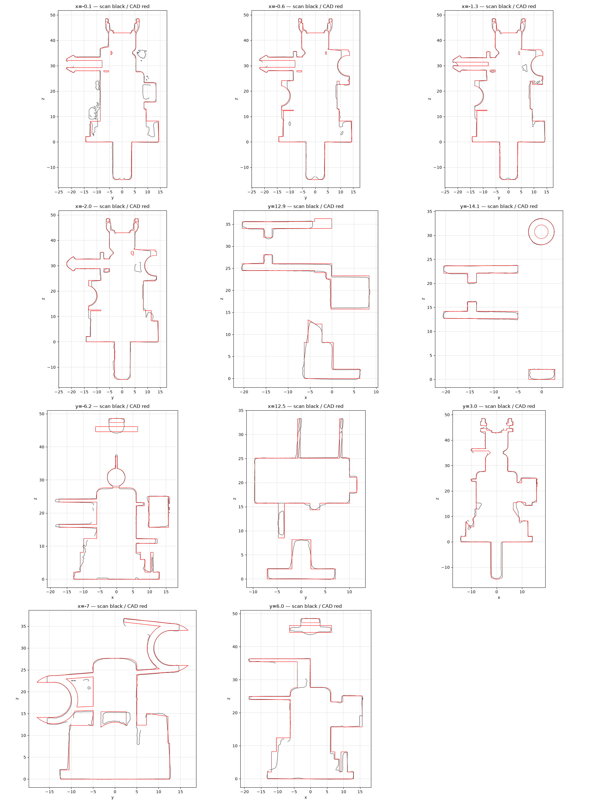

# OD-S01 Steam valve assembly — scan → STEP reverse-engineering report

| | |
|---|---|
| Part | `OD-S01` (ref 17, OEM AS00002707) — De'Longhi-type rotary steam valve assembly (cap with splined spindle and 3-fold cam ring, valve body with top clip port, two side hose ports, hose barb, microswitch), scanned as one mesh and delivered as one fused solid. |
| Input | [`scans/OD-S01_steam_valve/OD-S01_steam_valve_raw.stl`](../../../scans/OD-S01_steam_valve/) — full-resolution scan |
| Method | staged pipeline — intake → measure → build (build123d) → independent verifier → deliver |
| Caliper data | **none** — scan-only; units assumed mm |
| Status | **Owner-reviewed and accepted** (`DECISIONS.md`, `decisions/`) — tracked in #35 |

**Full report: [`deliver/README.md`](deliver/README.md)** · verifier report: [`qa/VERDICT.md`](qa/VERDICT.md).

## Delivered STEP

[`step/OD-S01_steam_valve.step`](../../OD-S01_steam_valve.step) — **use in CAD**. Datum frame: Intake: scan hash and health, working copy, datum = cap disc outer face (z 0, +Z into the body), upper valve column axis, microswitch face normal to +X (intake/alignment.json).

Same solid as the run's `build/OD-S01_steam-valve_datum.step`; only the STEP product / solid name was changed to `OD-S01 Steam valve assembly`, so sha256 values in `deliver/MANIFEST.json` refer to the run original. No scan-frame STEP is published — apply the inverse of `source/intake/alignment.json` to overlay the CAD on the raw scan.

Re-import check: 1 valid closed solid, 351 faces, volume 15,837.5 mm³, datum bbox 38.44 × 40.36 × 63.33 mm.

## Deviation (CAD ↔ scan)

| Direction | Measured |
|---|---|
| scan → CAD | p95 **0.449** / max 1.940 mm |
| CAD → scan (observable surface) | p95 0.761 / max 2.890 mm |

**Per zone:**

| Zone | Measured |
|---|---|
| Z1_spindle:scan_to_cad | p95 0.284 / max 1.338 |
| Z2_cap_cam_ring:scan_to_cad | p95 0.615 / max 1.593 |
| Z3_top_clip_port:scan_to_cad | p95 0.425 / max 0.890 |
| Z4_side_ports:scan_to_cad | p95 0.272 / max 0.956 |
| Z5_barb:scan_to_cad | p95 0.152 / max 0.764 |
| Z6_microswitch:scan_to_cad | p95 0.474 / max 0.883 |
| Z1_spindle:scan_to_cad | p95 ? / max ? |
| Z2_cap_cam_ring:scan_to_cad | p95 ? / max ? |
| Z3_top_clip_port:scan_to_cad | p95 ? / max ? |
| Z4_side_ports:scan_to_cad | p95 ? / max ? |
| Z5_barb:scan_to_cad | p95 ? / max ? |
| Z6_microswitch:scan_to_cad | p95 ? / max ? |

CAD → scan is dominated by surfaces the scanner never reached (bores, undersides, assembly interfaces); see `qa/VERDICT.md` for masks and clusters.

## Notes

- The run's reference photos were catalogue / web images and are **not redistributed**, so image links to `input/photos/` in the run documents are intentionally broken.
- Not copied from the run: meshes, STEP duplicates, NX files, deviation arrays and other files > 5 MB, superseded iterations.
- `deliverables/` of the run is at this folder's root; the run's `source/` (intake, measure, qa work files) is in [`source/`](source/).
