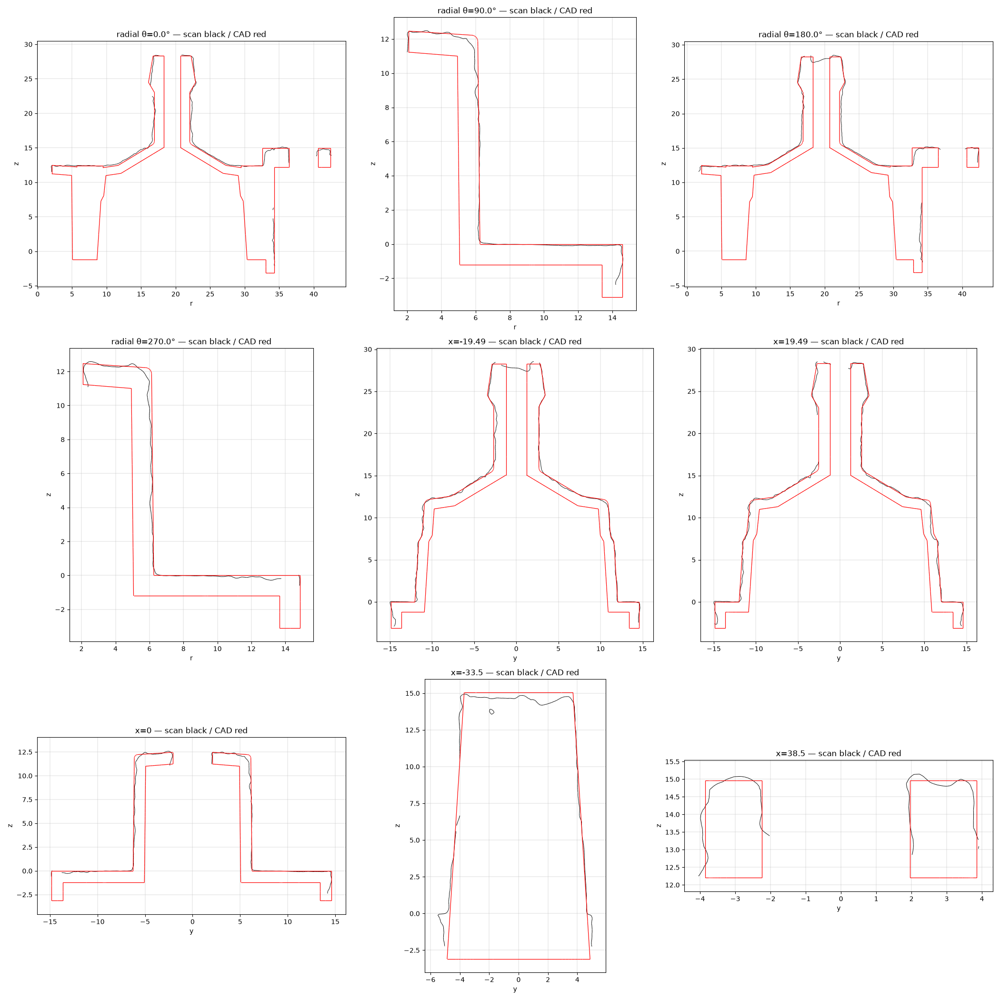

# OD-W03 Tray gasket (water tank seat) — scan → STEP reverse-engineering report

| | |
|---|---|
| Part | `OD-W03` (ref 30, OEM 5313236391) — Water tank valve cover (translucent moulded plastic): stadium flange with skirt, two valve cups with conical shoulders and single-barb hose nipples, a middle boss with a top hole, four ribs, and an L-shaped ear with a fixing hole at each end. |
| Input | [`scans/OD-W03_tank_seat/OD-W03_tank_seat_raw.stl`](../../../scans/OD-W03_tank_seat/) — full-resolution scan |
| Method | staged pipeline — intake → measure → build (build123d) → independent verifier → deliver |
| Caliper data | **none** — scan-only; units assumed mm |
| Status | **Owner-reviewed and accepted** (`DECISIONS.md`, `decisions/`) — tracked in #37 |

> **Part number:** Scanned without the black double gasket, which sits on the seat.

**Full report: [`deliver/README.md`](deliver/README.md)** · verifier report: [`qa/VERDICT.md`](qa/VERDICT.md).

## Delivered STEP

[`step/OD-W03_tank_seat.step`](../../OD-W03_tank_seat.step) — **use in CAD**. Datum frame: Intake: full-resolution scan (owner-confirmed), nothing removed; datum = flange top face (z = 0), origin = midpoint of the two cup axes, +X from cup A to cup B (align.py feature_line clock).

Same solid as the run's `build/OD-W03_datum.step`; only the STEP product / solid name was changed to `OD-W03 Tray gasket (water tank seat)`, so sha256 values in `deliver/MANIFEST.json` refer to the run original. No scan-frame STEP is published — apply the inverse of `source/intake/alignment.json` to overlay the CAD on the raw scan.

Re-import check: 1 valid closed solid, 106 faces, volume 6,260.8 mm³, datum bbox 84.80 × 29.43 × 31.41 mm.

## Deviation (CAD ↔ scan)

| Direction | Measured |
|---|---|
| scan → CAD | p95 **0.307** / max 0.785 mm |
| CAD → scan (observable surface) | p95 1.512 / max 3.063 mm |

CAD → scan is dominated by surfaces the scanner never reached (bores, undersides, assembly interfaces); see `qa/VERDICT.md` for masks and clusters.

## Notes

- The run's reference photos were catalogue / web images and are **not redistributed**, so image links to `input/photos/` in the run documents are intentionally broken.
- Not copied from the run: meshes, STEP duplicates, NX files, deviation arrays and other files > 5 MB, superseded iterations.
- `deliverables/` of the run is at this folder's root; the run's `source/` (intake, measure, qa work files) is in [`source/`](source/).
